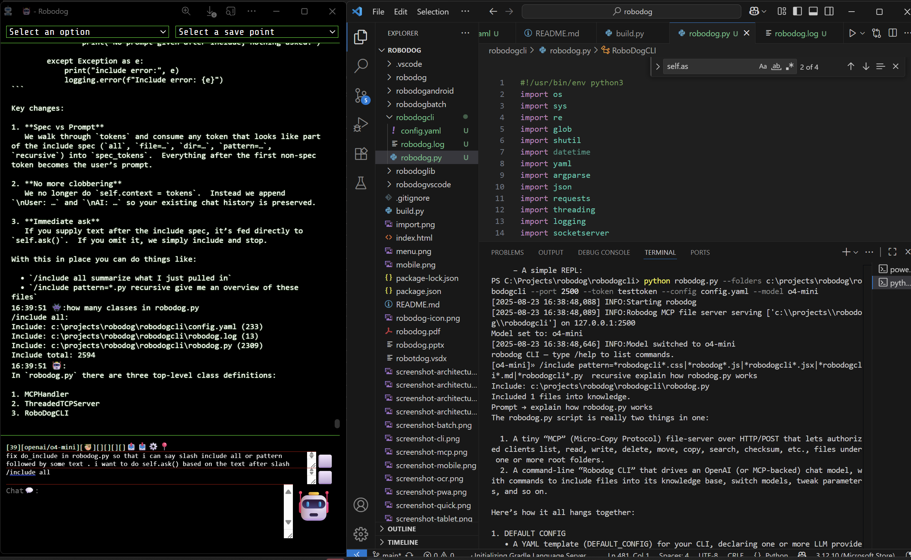

# Robodog AI  

  

## Overview  
Robodog is a lightweight, zero-install, command-line style generative AI client that integrates multiple providers (OpenAI, OpenRouter, LlamaAI, DeepSeek, Anthropic, Sarvam AI, Google Search API, and more) into a unified interface. Key capabilities include:

- Access to cutting-edge models: `o4-mini` (200k context), `gpt-4`, `gpt-4-turbo`, `dall-e-3`, Llama3-70b, Claude Opus/Sonnet, Mistral, Sarvam-M, Gemma 3n, etc.  
- Massive context windows (up to 200k tokens) across different models.  
- Seamless chat history & knowledge management with stashes and snapshots.  
- File import/export (text, Markdown, code, PDF, images via OCR).  
- In-chat file inclusion from a local MCP server.  
- Built-in web search integration.  
- Image generation & OCR pipelines.  
- AI-driven web automation/testing via Playwright (`/play`).  
- Raw MCP operations (`/mcp`).  
- Accessible, retro “console” UI with customizable themes and responsive design.  

---

## Try Robodog  

- **Web**: https://adourish.github.io/robodog/robodog/dist/  
- **Android**: https://play.google.com/store/apps/details?id=com.unclebulgaria.robodog  
- **npm packages**:  
  - `npm install robodoglib`  
  - `npm install robodogcli`  
  - `npm install robodog`  
- **Python**:  
  - `pip install robodogcli`  
  - `pip show -f robodogcli`  
  - `python -m robodogcli.cli --help`  
  - `python -m playwright install`  (optional)
   

---

## Configuration  

Click the ⚙️ icon in the top-menu to open settings, or edit your YAML directly:  

```yaml
configs:
  providers:
    - provider: openAI
      baseUrl: "https://api.openai.com"
      apiKey: "<YOUR_OPENAI_KEY>"
    - provider: openRouter
      baseUrl: "https://openrouter.ai/api/v1"
      apiKey: "<YOUR_ROUTER_KEY>"
    - provider: searchAPI
      baseUrl: "https://google-search74.p.rapidapi.com"
      apiKey: "<YOUR_RAPIDAPI_KEY>"

  specialists:
    - specialist: nlp
      resume: natural language processing, content generation
    - specialist: gi
      resume: image generation from text
    - specialist: search
      resume: web search integration

  mcpServer:
    baseUrl: "http://localhost:2500"
    apiKey: "testtoken"

  models:
    - provider: openAI
      model: gpt-4
      stream: true
      specialist: nlp
      about: best for reasoning
    - provider: openAI
      model: o4-mini
      stream: true
      specialist: nlp
      about: 200k token context, advanced reasoning
    - provider: openAI
      model: dall-e-3
      stream: false
      specialist: gi
      about: image creation
    - provider: searchAPI
      model: search
      stream: false
      specialist: search
      about: web search results
```

---

## Supported Models  

### OpenAI  
- gpt-4, gpt-4-turbo, gpt-3.5-turbo, gpt-3.5-turbo-16k, o4-mini, o1  
- dall-e-3  

### Others  
- LlamaAI: llama3-70b  
- Anthropic: Claude Opus 4, Claude Sonnet 4  
- DeepSeek R1  
- Mistral Medium 3, Devstral-Small  
- Sarvam-M  
- Google Gemma 3n E4B  

---

## Key Features  

- **Multi-Provider Support**: Switch between any configured provider or model on the fly (`/model`).  
- **Chat & Knowledge**: Separate panes for Chat History (💭) and Knowledge (📝)—both resizable.  
- **Stash Management**:  
  - `/stash <name>` — save current chat+knowledge  
  - `/pop <name>`   — restore a stash  
  - `/list`         — list all stashes  
- **File Import/Export**:  
  - `/import <glob>` — import files (.md, .js, .py, .pdf, images via OCR)  
  - `/export <file>` — export chat+knowledge snapshot  
- **MCP File Inclusion**:  
  - `/include all`  
  - `/include file=README.md`  
  - `/include pattern=*.js|*.css recursive`  
  - `/include dir=src pattern=*.py recursive`  
- **Raw MCP Operations**:  
  - `/mcp OP [JSON]` — e.g. `/mcp LIST_FILES`, `/mcp READ_FILE {"path":"./foo.py"}`  
- **Web Fetch & Automation**:  
  - `/curl [--no-headless] <url> [<url2>|<js>]` — fetch pages or run JS  
  - `/play <instructions>` — run AI-driven Playwright tests end-to-end  
- **Web Search**:  
  - Use `search` model or click 🔎 to perform live web queries.  
- **Image Generation & OCR**: Ask questions to `dall-e-3` or drop an image to extract text via OCR.  
- **Interactive Console UI**: Retro “pip-boy green” theme, responsive on desktop/mobile, accessible.  
- **Performance & Size Indicators**: Emoji feedback for processing speed and token usage.  
- **Extensive Command Palette**: `/help` lists all commands, indicators, and settings.  

---

## Usage Examples  

### 1) AI-Driven Web Tests with `/play`  

Robodog will:  
1. Parse your natural-language instructions into discrete steps  
2. Spin up a headless browser and execute each step, retrying once on failure  
3. Log each attempt and summarize as Success/Failure  

```
/play navigate to https://example.com, extract the page title, and verify it contains 'Example Domain'
```

Output snippet:
```
Instructions: navigate to https://example.com, extract the page title, and verify it contains 'Example Domain'

----- Parsed steps -----
1. Navigate to https://example.com
2. Extract the page title
3. Verify the title contains 'Example Domain'

>>> Starting step 1: Navigate to https://example.com
--- Attempt 1 on page: <no title> (about:blank) ---
Step 1 attempt 1 → Success: None

...  

--- /play summary ---
Step 1: Success
Step 2: Success
Step 3: Success
```

### 2) Fetch & Scrape with `/curl`  

```
/curl https://example.com
```
→ prints page text.  

```
/curl --no-headless example.com document.querySelector('h1').innerText
```
→ runs JS snippet to extract an element.

### 3) Include Local Files via MCP  

```
/include pattern=*.js recursive fix bug in parser
```
→ pulls matching files from your project into context, then asks the LLM.

### 4) Raw MCP Commands  

```
/mcp LIST_FILES
/mcp READ_FILE {"path":"./src/cli.py"}
```

### 5) Switch Model on the Fly  

```
/model o4-mini
```
→ “Model set to: o4-mini”

### 6) Import & Export  

```
/import **/*.md
/export conversation_snapshot.txt
```

---

## Robodog CLI Usage  

```bash
python -m robodog.cli \
  --folders /path/to/project/src /another/root \
  --host 127.0.0.1 \
  --port 2500 \
  --token my_mcp_token \
  --config config.yaml \
  --model o4-mini
```

Type `/help` in the CLI for a full list of commands.

---

## MCP File Service Syntax  

```
/include all
/include file=*.md
/include pattern=*.py recursive
/include dir=src pattern=*.js recursive
```
*Globs: `*`, `?`, character classes. No full regex.*  

---

## MCP Server Startup  

```bash
python -m robodog.cli --folders . --port 2500 --token testtoken --config config.yaml
```

---

## Supported File Formats  

- Text & Markdown: `.txt`, `.md`, `.markdown`  
- Code: `.js`, `.ts`, `.py`, `.java`, `.c`, `.cpp`, `.go`, `.rs`  
- Config/Data: `.yaml`, `.yml`, `.json`, `.xml`, `.csv`  
- PDF: `.pdf`  
- Images: `.png`, `.jpg`, `.jpeg`, `.gif`, `.bmp`, `.tiff`  

---

## Command Reference  

Run `/help` in-app or see the list below:

```
/help                    — show help  
/models                  — list configured models  
/model <name>            — switch model  
/key <prov> <key>        — set API key for provider  
/getkey <prov>           — view API key for provider  
/import <glob>           — import files into knowledge  
/export <file>           — export chat+knowledge snapshot  
/clear                   — clear chat & knowledge  
/stash <name>            — stash chat+knowledge  
/pop <name>              — restore a stash  
/list                    — list stashes  
/temperature <n>         — set temperature (0–2)  
/top_p <n>               — set nucleus sampling  
/max_tokens <n>          — set max tokens  
/frequency_penalty <n>   — set frequency penalty  
/presence_penalty <n>    — set presence penalty  
/stream                  — enable streaming mode  
/rest                    — disable streaming (REST mode)  
/folders <dirs>          — update MCP roots  
/include …               — include files via MCP  
/curl …                  — fetch web pages / run JS  
/play <instructions>     — run AI-driven Playwright tests  
/mcp OP [JSON]           — invoke raw MCP operation  
```

*Keyboard Shortcuts:*  
- CTRL+SHIFT+UP — cycle through stashes  
- CTRL+S        — save a snapshot  

---

## Indicators & Emojis  

- `[💭]` Chat History  
- `[📝]` Knowledge Content  
- `[💬]` Chat Text  
- `[👾]` User  
- `[🤖]` Assistant  
- `[💾]` System  
- `[🐋/🦕/🐘/🐁]` Token usage levels  
- `[🐢/🦘/🐆/🦌/🐕]` Performance (response time)  

---

## Accessibility & PWA  

- Meets Section 508 and WCAG principles.  
- Installable as a PWA on supported devices.  

---

## Build & Run  

```bash
# Clone or unzip robodog
cd robodog
python build.py
# Open in browser
open ./dist/robodog.html
```  

---

Enjoy Robodog AI—the future of fast, contextual, and extensible AI interaction!