# 🤖 Robodog

Robodog Terminal is an **agentic coding terminal** for your shell — a tool-use loop
that reads and edits files, runs commands, runs tests, and self-corrects, driven by
a large language model. It's built to run leading models on **self-hosted / air-gapped LLM gateways**, and works just as well with OpenAI-compatible
models or a fully offline mock for development.

> This repository is a monorepo. Terminal mode (`apps/cli/robodog/robodog_terminal`)
> is the active, flagship client — everything else is archived.

## Preview

Six subagents fanned out in one turn — each result attributed, the answer
surfaced (not the metadata):

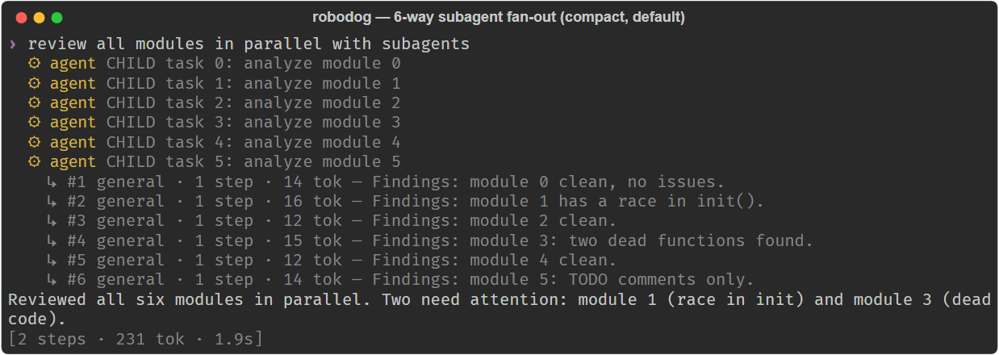

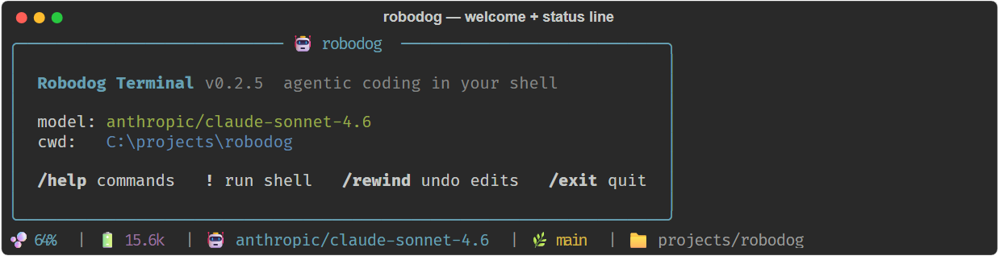

More screenshots in the [gallery](#screenshots) below.

## Get Started

This walkthrough assumes **nothing is installed yet**. Read it top to bottom
— every step is here in order, and you never need to jump ahead. Budget
about 5 minutes (15 if you choose the encrypted KeePass option in step 6).

### Step 1 — Check you have Python 3.9+

```bash
python --version         # try python3 --version if that isn't found
```

No Python? Install it from [python.org/downloads](https://www.python.org/downloads/)
(on Windows, tick **"Add Python to PATH"** in the installer — it saves you
step 3), then reopen your terminal and check again.

### Step 2 — Install Robodog

```bash
pip install -U robodog-terminal
```

Watch the output for a line like `WARNING: The script robodog-terminal.exe
is installed in '...' which is not on PATH`. If you see it, note that
directory — step 3 needs it.

### Step 3 — Make the `robodog-terminal` command work

```bash
robodog-terminal --version
```

If that prints a version, skip to step 4. If you get **`command not
found`** (or `not recognized` on Windows), pip's scripts directory isn't on
your `PATH`. Either work around it or fix it properly:

**Work around it (nothing to configure)** — this always works:

```bash
python -m robodog_terminal --version
```

Use `python -m robodog_terminal` in place of `robodog-terminal` for the rest
of this guide.

**Or fix PATH permanently — Windows.** First find the Scripts directory:
`pip show -f` lists the exes as `..\Scripts\robodog-terminal.exe` — that's
**relative to the `Location:` line**, so a user-level install at
`...\AppData\Roaming\Python\Python312\site-packages` puts them in
`...\AppData\Roaming\Python\Python312\Scripts`:

```powershell
python -m pip show -f robodog-terminal    # Location: + "..\Scripts\..." entries
[Environment]::SetEnvironmentVariable("Path",
    [Environment]::GetEnvironmentVariable("Path", "User") + ";<the-Scripts-dir>",
    "User")
```

⚠️ **Do NOT use `setx PATH ...` for this.** `setx` silently truncates the
value to 1024 characters — on a machine with a long PATH it will *corrupt*
your user PATH while printing `SUCCESS` (see
[Troubleshooting](#troubleshooting) if that already happened). The
`[Environment]` method above has no such limit and touches only the
user-level PATH.

⚠️ **Then close your terminal and open a brand-new one.** PATH edits only
write the registry — already-open terminals (including new tabs of an open
Windows Terminal, and anything launched from VS Code) keep their old `PATH`
forever. This is the single most common reason people think the fix "didn't
work".

**Or fix PATH permanently — macOS/Linux** (usually `~/.local/bin`):

```bash
echo 'export PATH="$HOME/.local/bin:$PATH"' >> ~/.bashrc
source ~/.bashrc
```

> Note the **dash**: the Python *package* is `robodog_terminal` (underscore),
> but the installed *command* is `robodog-terminal` (dash). `robodogt` is a
> short alias for the same command.

### Step 4 — Smoke test with no API key

```bash
robodog-terminal --echo
```

This runs a scripted offline demo — no key, no network, no cost. You should
see the 🤖 banner and a `›` prompt. Type `/exit` to quit. If this works, your
install is sound and everything left is credentials.

### Step 5 — Get an API key

Robodog defaults to **OpenRouter**, which proxies most major models behind
one key. Create one at [openrouter.ai/keys](https://openrouter.ai/keys) and
copy it — it looks like `sk-or-v1-...`. (Prefer OpenAI, Groq, a local Ollama,
or a self-hosted gateway? Get set up here first, then see
[Configuration](#configuration) to switch providers.)

### Step 6 — Store the key

Pick **one** of these. Don't do both — plain env vars always win over
KeePass, so a stale `ROBODOG_LLM_KEY` will silently shadow your vault.

|  | Option A — config file | Option B — KeePass |
|---|---|---|
| Setup time | ~1 min | ~10 min |
| Key stored as | plaintext on disk | encrypted vault |
| Good for | trying it out, personal machines | shared/work machines, key rotation, teams already on KeePass |

---

#### Option A — plaintext config file

Robodog reads `~/.robodog/config.env` at startup (it's user-local and
gitignored — never committed):

```bash
mkdir -p ~/.robodog
echo "ROBODOG_LLM_KEY=sk-or-v1-your-key-here" >> ~/.robodog/config.env
```

On Windows PowerShell:

```powershell
New-Item -ItemType Directory -Force "$env:USERPROFILE\.robodog" | Out-Null
Add-Content "$env:USERPROFILE\.robodog\config.env" "ROBODOG_LLM_KEY=sk-or-v1-your-key-here"
```

Now skip to **step 7**.

---

#### Option B — encrypted KeePass vault

Robodog can pull keys from a KeePass database at startup, unlocked by a
**keyfile** so there's no password prompt. Three pieces have to line up: the
database, a loader module, and two config lines pointing at them.

**6B.1 — Install the KeePass library:**

```bash
pip install pykeepass
```

**6B.2 — Create the vault.** Robodog builds it for you — start it and run:

```
/keepass init sk-or-v1-your-key-here
```

That creates the database, a random keyfile (so there's no master-password
prompt), the loader module, and an `OpenRouter` entry holding your key — all
in `~/.robodog/`, which is where Robodog looks by default.

⚠️ **Back up `~/.robodog/automation-keys.keyfile`.** Without it the vault
cannot be opened — there is no master password to fall back on. `/keepass
init` will never overwrite an existing vault for exactly this reason.

Other `/keepass` subcommands:

| Command | Does |
|---|---|
| `/keepass` | show vault status + which provider entries were found |
| `/keepass init [key]` | create the vault, keyfile, and loader |
| `/keepass set <Title> <key>` | add or rotate one provider's key |

The entry **title must be exactly `OpenRouter`** — that's what Robodog looks
up — and the key goes in the *password* field. Titles for other providers:

| Entry title | Used by | URL field |
|---|---|---|
| `OpenRouter` | default / `--backend openrouter` | `https://openrouter.ai/api/v1` |
| `OpenAI` | `--backend openai` | `https://api.openai.com/v1` |
| `Gateway` | `--backend gateway` (username = access key, password = secret key) | — |

⚠️ Back up `automation-keys.keyfile` somewhere safe. Without it the vault
**cannot** be opened — there's no master password to fall back on.

**6B.3 — The loader module.** `/keepass init` already wrote this for you —
skip ahead unless you're wiring up an existing vault by hand. Robodog
imports the file by name and calls exactly this interface
(`~/.robodog/keepass_loader.py`):

```python
# ~/.robodog/keepass_loader.py
from pykeepass import PyKeePass

class KeePassLoader:
    def __init__(self, db_path, keyfile=None):
        self.db_path, self.keyfile, self.kp = db_path, keyfile, None

    def unlock(self, password=None):
        self.kp = PyKeePass(self.db_path, password=password, keyfile=self.keyfile)

    def get_credentials(self, title):
        e = self.kp.find_entries(title=title, first=True)
        if e is None:
            return None
        return {"title": e.title, "username": e.username,
                "password": e.password, "url": e.url}
```

**6B.4 — Point Robodog at the vault.** If you used the exact paths above
(`~/.robodog/automation-keys.kdbx`), that's the built-in default and **you
can skip this** — go to step 7.

Only if your vault lives elsewhere (e.g. you already keep API keys in an
existing KeePass database), add these to `~/.robodog/config.env`:

```bash
ROBODOG_KEEPASS_DB=C:\keys\automation-keys.kdbx
ROBODOG_KEEPASS_DIR=C:\keys
```

- `ROBODOG_KEEPASS_DB` — full path to the `.kdbx`
- `ROBODOG_KEEPASS_DIR` — folder containing `keepass_loader.py`
- `ROBODOG_KEEPASS_KEYFILE` — only if the keyfile *isn't* next to the
  database with the same name and a `.keyfile` extension

**Safer: keep the keyfile away from the database.** The keyfile IS the key —
anyone holding both files owns every credential inside. Storing them apart
(database in a backed-up or synced folder, keyfile on local-only disk or a
USB stick that's normally unplugged) means neither file alone is worth
anything:

```bash
ROBODOG_KEEPASS_DB=C:\keys\automation-keys.kdbx
ROBODOG_KEEPASS_DIR=C:\keys
ROBODOG_KEEPASS_KEYFILE=D:\secure\automation-keys.keyfile
```

In particular, don't let the keyfile ride along in the same cloud-sync
folder as the database — that recreates the both-files-in-one-place risk on
every synced machine.

Values are read literally: no quotes, and **don't escape backslashes** —
Windows paths and spaces work as-is.

> **Reusing an existing vault?** You need only two things: an entry titled
> exactly `OpenRouter`, and a `keepass_loader.py` (from 6B.3) in the folder
> `ROBODOG_KEEPASS_DIR` points at. No need to create a second database.

### Step 7 — Verify your setup

```bash
robodog-terminal
```

At the `›` prompt, run:

```
/doctor
```

`/doctor` reports which keys and vars it found — **never their values** — and
flags mistakes like a mismatched backend/model pairing. On the KeePass path
you'll also see a `keepass` line reporting `unlocked` plus the entry titles
it matched.

Common failures and what they mean:

| `/doctor` says | Fix |
|---|---|
| no key found | `config.env` is missing, misspelled, or in the wrong folder — it must be `~/.robodog/config.env` |
| keepass not unlocked | wrong `ROBODOG_KEEPASS_DB` path, or the keyfile wasn't found — it must be beside the `.kdbx` (same name, `.keyfile` extension) or pointed at explicitly with `ROBODOG_KEEPASS_KEYFILE` (e.g. when it lives on separate media) |
| keepass unlocked, no entry | your entry title isn't exactly `OpenRouter` |
| 401 / key rejected at runtime | key is wrong or revoked — regenerate at [openrouter.ai/keys](https://openrouter.ai/keys) |

### Step 8 — Run your first real task

```bash
robodog-terminal
```

Type a task at the `›` prompt:

```
create fib.py that prints fib(10), run it, and report the result
```

Robodog writes the file, runs it, and reports back. `/rewind` undoes the file
changes, `/help` lists every command. You're set — see
[More examples](#more-examples) for other providers and flags.

---

<details>
<summary><b>Prefer to run from source instead of PyPI?</b></summary>

```bash
git clone https://github.com/adourish/robodog.git
cd robodog/apps/cli/robodog
pip install rich prompt_toolkit requests        # core deps
python robodog_terminal/app.py --echo
```

Credential setup (steps 5–7) is identical. Substitute
`python robodog_terminal/app.py` wherever this guide says
`robodog-terminal`.

</details>

## More examples

```bash
# offline demo — no keys needed (scripted, just to see the UI)
robodog-terminal --echo

# live via OpenRouter (default provider; any catalog id works)
robodog-terminal --backend openrouter --model anthropic/claude-sonnet-4.6

# live against OpenAI directly (bare ids, no provider/ prefix)
robodog-terminal --backend openai --model gpt-4o

# air-gapped gateway (SEMOSS-style runPixel; keys from KeePass)
robodog-terminal --backend gateway

# one-shot, non-interactive (great for scripts/CI)
robodog-terminal --backend openai -p "fix the bug in x.py and run the tests"
```

From a source checkout, replace `robodog-terminal` with
`python robodog_terminal/app.py` (run inside `apps/cli/robodog`). The test
suite runs from there too:

```bash
cd apps/cli/robodog

# deterministic, keyless
python robodog_terminal/run_tests.py

# opt-in LIVE performance test: fires N real subagents concurrently and
# reports the fan-out speedup (needs a live backend; skips cleanly without one)
ROBODOG_PERF=1 python robodog_terminal/run_tests.py
python robodog_terminal/perf_fanout.py 12        # or run it directly
```

Inside the terminal, just type a task (`create hello.py and run it`). Useful commands:

| | |
|---|---|
| `/help` | list all commands |
| `/plan` | read-only: propose a plan, then approve to implement |
| `/bg <task>` · `/tasks` · `/tail` · `/kill` | background subagents |
| `/rewind` | undo file changes from a previous prompt |
| `/model <name>` · `/doctor` · `/context` · `/compact` | switch model · diagnostics · context |
| `/keepass [init\|set]` | create or inspect the encrypted key vault |
| `! <cmd>` | run a shell command directly (shared with the agent) |
| `@path/to/file` | inline a file into your message |

Handy flags: `--guard confirm` (ask before destructive commands),
`--permission-mode plan`, `--editor vscode` (clickable `file:line` jumps),
`--verbose`.

**Experimental — sticky input** (`ROBODOG_STICKY_INPUT=1`): a fixed input box
anchored at the bottom while the agent works, with tool output scrolling
above it, so a follow-up you type mid-turn never gets scrambled by streamed
output. Off by default (the raw reader is used otherwise); enable it in
`config.env` or the environment and report back if anything looks off.

## What it does

Prompted tool-use loop (intent nudge + circuit breaker) · tools:
`read_file / write_file / edit_file / multi_edit / bash / run_script / run_tests
/ glob / grep / list_dir` with read-before-edit, post-edit syntax verification,
and whitespace-tolerant edits · **parallel subagents** (fan out several in one
turn — they run concurrently) plus background subagents ·
per-prompt **checkpoints** with `/rewind` · JSONL **sessions** (`/resume`,
`--continue`) · **plan mode** · **skills & custom commands** (`.robodog/` or
`.claude/` — Claude Code layouts work unchanged) ·
`CLAUDE.md`/`ROBODOG.md` instruction hierarchy · a rich + prompt_toolkit **TUI**
(emoji/color status line, clickable file & `file:line` links, multiline paste,
mid-turn Ctrl+B backgrounding) · **headless `-p`** (text/json) · `/doctor`.

## Screenshots

Every image is rendered by the real UI code (rich SVG export), not a mockup.
The default trace is compact — summaries, counts, attributed subagent
answers; `/verbose` (or `--verbose`) switches to the full per-call feed.

**Tool trace — summaries, a bounded live stream, loud failures.** `read_file`
reports a line count instead of echoing content; long command output shows a
15-line head with the rest held back (the model still gets everything);
failures render red, never dim:

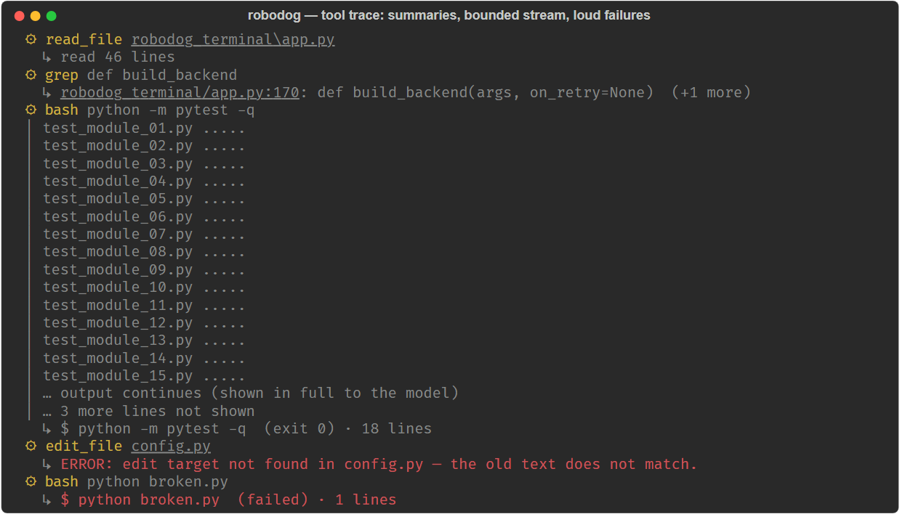

**The same fan-out with `/verbose`** — per-child `#N` tool calls and full
untruncated results:

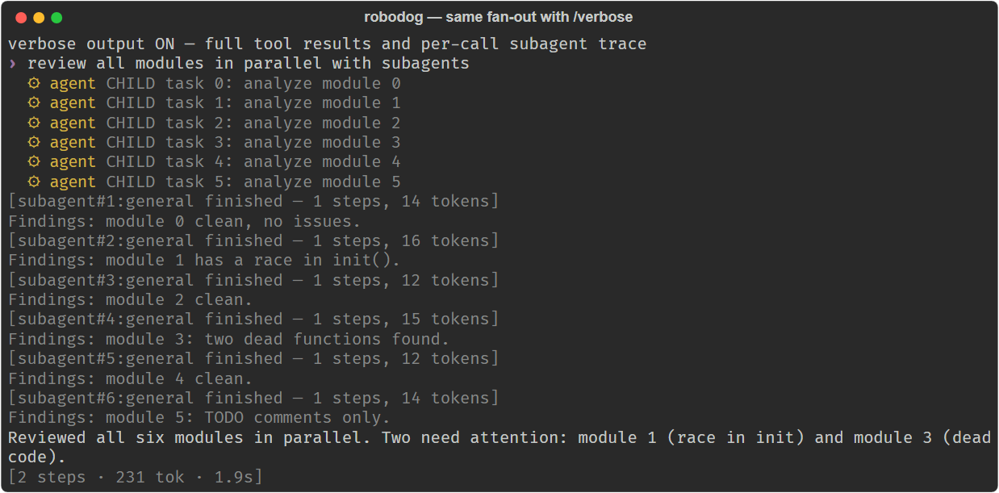

**Plan mode** — the agent proposes read-only, you approve, it implements:

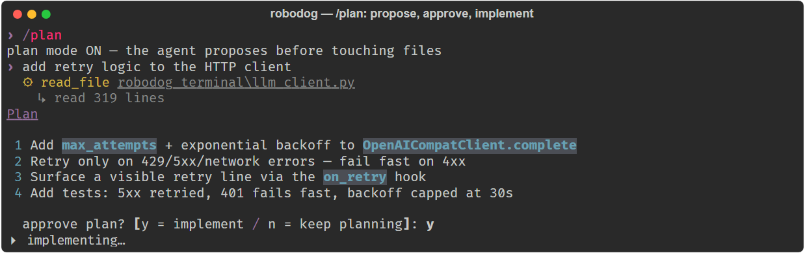

**Colored diff preview** on every file edit (paths are clickable):

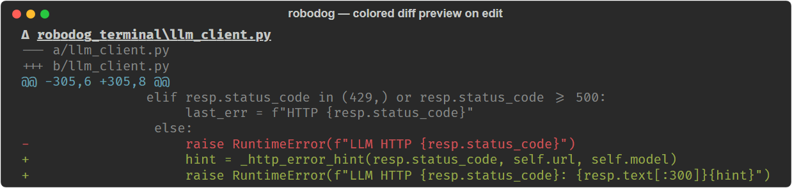

**Live task checklist** the agent maintains (`/todos`):

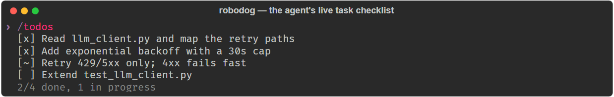

**Background subagents** — `/bg` detaches work, `/tasks` lists it, done
notifications land above the prompt:

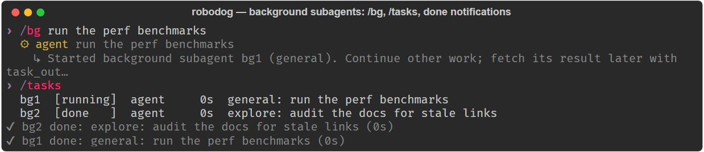

**`/doctor`** — environment diagnostics, including the model/backend pairing
check that catches a mismatch before any request is sent:

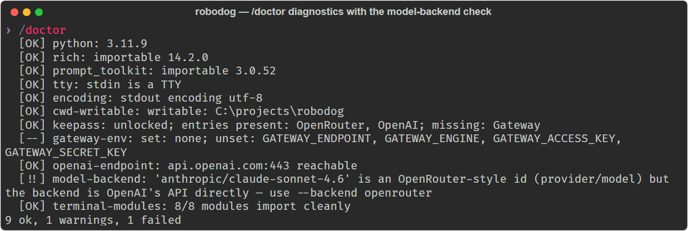

**Errors explain themselves** — provider mistakes come back with the fix, not
just a status code:

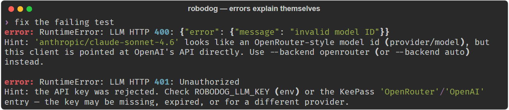

### Use cases

**Search multiple websites in parallel** — six subagents each fetch a live
site through `run_script` and report its title, 3.6× faster than doing it
serially (this and the next scene run real network calls; regenerate with
`generate.py --live`):

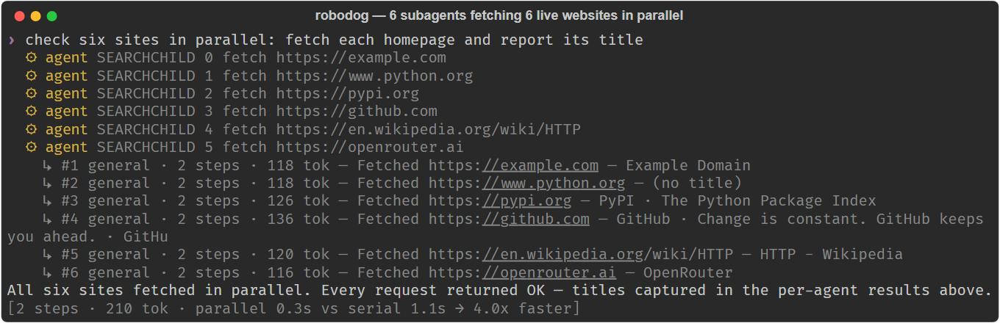

**A mixed-workload agent squad in one turn** — python, powershell, and bash
scripts, live GitHub + PyPI API calls, and a Playwright CLI browser capture,
all concurrent, 4.3s wall:

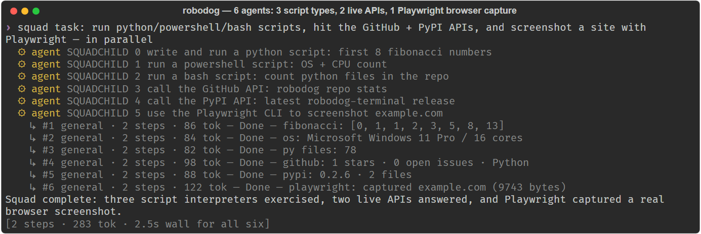

The Playwright agent's own artifact — a real browser page capture:

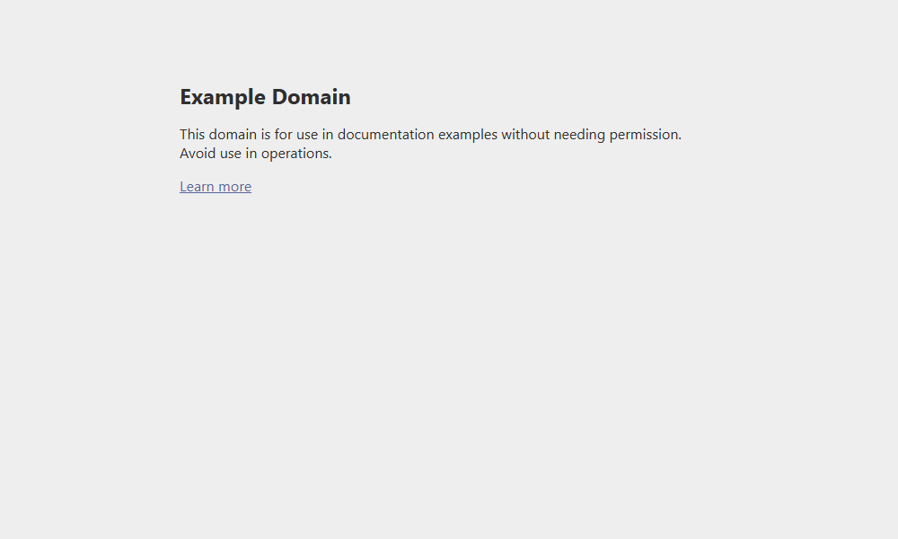

**Claude Code projects work unchanged** — extensions in `.claude/commands`,
`.claude/agents`, and `.claude/skills` are discovered alongside `.robodog/`
(which stays the override layer), just like `CLAUDE.md` instructions:

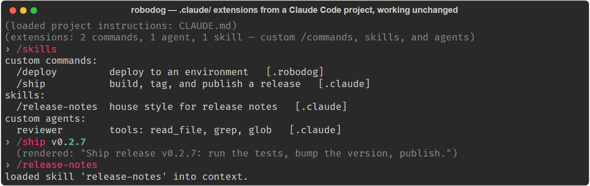

These three scenes are also automated tests: `ROBODOG_LIVE=1 python
robodog_terminal/run_tests.py` runs the live web/API/Playwright suite, and
`.claude`/`.robodog` discovery is covered in the default suite.

## Configuration

First-time setup lives in [Get Started](#get-started) above. This section is
the reference for everything beyond the basic OpenRouter-key path.

### Keys — all the options

Every setting below is an environment variable. Robodog reads it from two
places, and a **real OS environment variable wins** over the file:

| Env var | Purpose |
|---|---|
| `ROBODOG_LLM_KEY` | API key for the OpenAI-compatible backend (OpenRouter by default) |
| `ROBODOG_LLM_URL` | override the base URL (OpenAI, Groq, LiteLLM, local Ollama, …) |
| `ROBODOG_MODEL` | default model id |
| `ROBODOG_KEEPASS_DB` / `ROBODOG_KEEPASS_DIR` / `ROBODOG_KEEPASS_KEYFILE` | KeePass vault, loader dir, keyfile (see [KeePass reference](#keepass-reference)) |
| `GATEWAY_ENDPOINT` / `GATEWAY_ENGINE` / `GATEWAY_ACCESS_KEY` / `GATEWAY_SECRET_KEY` | self-hosted runPixel-style gateway |

#### How to set them

**Option 1 — `config.env` (simplest, robodog-only).** Robodog auto-loads
`~/.robodog/config.env` at startup: one `KEY=VALUE` per line, **no quotes, no
spaces around `=`, and don't escape backslashes** — Windows paths work as-is.
No new terminal needed.

```
ROBODOG_KEEPASS_DB=C:\Keys\automation-keys.kdbx
ROBODOG_KEEPASS_DIR=C:\Keys
```

**Option 2 — real OS environment variables (available to every program).**
Set them once at the user level; they persist across reboots.

Windows PowerShell — use `[Environment]::SetEnvironmentVariable`, **not
`setx`** (`setx` truncates long values to 1024 chars and can corrupt PATH):

```powershell
[Environment]::SetEnvironmentVariable("ROBODOG_KEEPASS_DB", "C:\Keys\automation-keys.kdbx", "User")
[Environment]::SetEnvironmentVariable("ROBODOG_KEEPASS_DIR", "C:\Keys", "User")
```

macOS / Linux — append to your shell profile:

```bash
echo 'export ROBODOG_KEEPASS_DB="$HOME/keys/automation-keys.kdbx"' >> ~/.bashrc
echo 'export ROBODOG_KEEPASS_DIR="$HOME/keys"' >> ~/.bashrc
source ~/.bashrc
```

After setting OS variables, **open a brand-new terminal** — already-open
windows keep the old environment. Don't set the same variable both ways: if
it's in a real env var *and* `config.env`, the OS variable wins, so a stale
one silently shadows the file.

### KeePass reference

Setup steps are in [step 6, Option B](#option-b--encrypted-keepass-vault).
This is the reference for what Robodog looks for once it's configured.

Default layout — all three in `~/.robodog/`, overridable by env var:

```
~/.robodog/
├── keepass_loader.py           # loader module (ROBODOG_KEEPASS_DIR)
├── automation-keys.kdbx        # the database  (ROBODOG_KEEPASS_DB)
└── automation-keys.keyfile     # keyfile auth  (ROBODOG_KEEPASS_KEYFILE)
```

Entries are matched by **exact title**; the API key goes in the *password*
field:

| Entry title | Used by | URL field (optional override) |
|---|---|---|
| `OpenRouter` | `--backend openrouter` / auto | `https://openrouter.ai/api/v1` |
| `OpenAI` | `--backend openai` | `https://api.openai.com/v1` |
| `Gateway` | `--backend gateway` (username = access key, password = secret key) | — |

Resolution order per backend: `ROBODOG_LLM_KEY` env var → `config.env` →
KeePass entry. **Env wins**, so remove `ROBODOG_LLM_KEY` from `config.env`
if you want the vault to be used.

To rotate a token, overwrite the entry's password field (KeePassXC or a
short `pykeepass` script) — Robodog picks up the new value on next start,
with no config change.

**Use an existing entry under a different title.** Set
`ROBODOG_KEEPASS_LLM_ENTRY` to point the openai/openrouter backend at any
entry instead of the default `OpenAI` / `OpenRouter`:

```
ROBODOG_KEEPASS_LLM_ENTRY=My-Gateway-Entry
```

**Gateways that want an `access:secret` key** (SEMOSS-style
OpenAI-compatible endpoints). When the entry stores the two halves in its
**username** (access key) and **password** (secret) fields,
`ROBODOG_LLM_KEY_FORMAT=user:pass` joins them into `access:secret` for the
`Authorization` header; the base URL comes from the entry's URL field:

```
ROBODOG_KEEPASS_LLM_ENTRY=My-Gateway-Entry
ROBODOG_LLM_KEY_FORMAT=user:pass
REQUESTS_CA_BUNDLE=C:\path\to\private-ca.pem   # if the endpoint uses a private cert
```

Then `--backend openai --model <engine-id>` reads the key and URL straight
from the vault — the secret never touches a file. (`REQUESTS_CA_BUNDLE` is a
standard `requests` env var; robodog honors it for endpoints behind a
private/internal CA.)

#### Worked example — a self-hosted OpenAI-compatible gateway

A complete `~/.robodog/config.env` for a SEMOSS-style enterprise gateway
that speaks the OpenAI protocol, keeps its key in a vault as
`access:secret`, and sits behind a private CA. Substitute your own host,
entry, engine id, and cert path:

```
ROBODOG_KEEPASS_DB=C:\keys\automation-keys.kdbx
ROBODOG_KEEPASS_DIR=C:\keys
ROBODOG_LLM_URL=https://your-gateway.internal.example/Monolith/api/model/openai
ROBODOG_KEEPASS_LLM_ENTRY=My-Gateway-Entry
ROBODOG_LLM_KEY_FORMAT=user:pass
ROBODOG_MODEL=<engine-id-from-the-gateway>
REQUESTS_CA_BUNDLE=C:\Users\<you>\gateway-ca.pem
```

```
robodog-terminal --backend openai
```

What each line does, and the order things fail in if one is wrong:

| Line | Purpose | If wrong |
|---|---|---|
| `ROBODOG_KEEPASS_DB` / `DIR` | locate the vault + `keepass_loader.py` | `/doctor` keepass: loader/db MISSING |
| `ROBODOG_LLM_URL` | the gateway's OpenAI base URL | HTTP 404 (try `.../openai/chat/completions`) |
| `ROBODOG_KEEPASS_LLM_ENTRY` | which vault entry holds the key | falls back to echo (no key found) |
| `ROBODOG_LLM_KEY_FORMAT=user:pass` | join access + secret into one key | HTTP 401 (only the secret sent) |
| `ROBODOG_MODEL` | the engine/model id to request | HTTP 400 invalid model ID |
| `REQUESTS_CA_BUNDLE` | trust the gateway's private CA | `OSError: Could not find a suitable TLS CA certificate bundle` (path missing) or `CERTIFICATE_VERIFY_FAILED` (wrong cert) |
| `ROBODOG_LLM_MAX_CONCURRENCY` (optional) | cap simultaneous requests. A custom gateway (non-mainstream URL) is **auto-capped to 2**; set `1` for a very slow one, or a higher number to lift it | parallel subagents cause `ReadTimeout`s under load |
| `ROBODOG_LLM_TIMEOUT` (optional) | per-request timeout in seconds. A custom gateway defaults to **300**; mainstream providers to 120. Raise it (e.g. `600`) if big-context requests are slow | single requests time out on large prompts |

`/doctor`'s `llm-config` line shows both values so you can confirm they took
effect — if it says `max concurrency: unlimited` while a fan-out is timing
out, the env var isn't loaded (wrong `config.env` location, or not exported).

Run `/doctor` after editing — it reports the vault entry the backend will
actually read (`LLM entry '<title>': present|MISSING`) and the
model/backend pairing, so most of the table above is caught before you send
a prompt. (`config.env` must live at `~/.robodog/config.env` —
`%USERPROFILE%\.robodog\config.env` on Windows — not the directory you
launch from.)

**Setup workflow, start to finish** (the four commands that get a
private-CA gateway working from inside robodog):

```
robodog-terminal --backend openai
› /keepass loader                     # write the loader if the vault dir lacks it
› /cert                               # capture the gateway's TLS chain -> REQUESTS_CA_BUNDLE
› /doctor                             # confirm: LLM entry present, ca-bundle present, model-backend ok
› /test                              # send a tiny request — ✓ connected, or the exact failing layer
```

- **`/keepass loader`** writes `keepass_loader.py` into the vault dir
  (`ROBODOG_KEEPASS_DIR`) without creating or touching the vault — for when
  you copied a `.kdbx` somewhere (e.g. `C:\keys`) but the loader is missing.
- **`/cert [host]`** connects to the gateway (host taken from
  `ROBODOG_LLM_URL` when omitted), captures its certificate **chain**, and
  writes a PEM to `REQUESTS_CA_BUNDLE`. It prints each cert's subject/issuer
  — **verify the root is your org's internal CA before trusting it.** Needs
  network reach to the host (VPN if internal). Uses `openssl` (Git ships it
  on Windows) for the full chain; without it, captures the leaf only.
- **`/test`** sends a one-word request through the live backend — it
  exercises cert + key + URL + model together and reports `✓ connected` or
  the precise error (401 key, 404 URL, TLS, …) without adding to the
  conversation.

### Hooks & permissions

Drop a `settings.json` in `.robodog/` or `.claude/` (project or `~`; project
wins, `.robodog` over `.claude` — Claude Code settings work unchanged):

```json
{
  "permissions": {
    "allow": ["bash(git *)"],
    "deny":  ["bash(rm -rf *)", "write_file(*.env)"]
  },
  "hooks": {
    "PreToolUse":  [{ "matcher": "write_file|edit_file",
                      "command": "python lint_gate.py" }],
    "PostToolUse": [{ "matcher": "bash", "command": "python audit_log.py" }],
    "Stop":        [{ "command": "powershell -c '[console]::beep(880,120)'" }]
  }
}
```

**Permissions** — rules are `tool` or `tool(glob)`, matched against the
call's main argument (the command for `bash`/`run_script`, the path for file
tools). `deny` always blocks (the agent is told not to retry); `allow`
pre-approves the call past the `--guard confirm` prompt; anything unmatched
keeps the default behavior.

**Hooks** — shell commands run on agent events, with a JSON payload
(`event`, `tool_name`, `tool_input`, `tool_result`, `cwd`) on stdin.
`matcher` is a regex against the tool name (omit it to match every tool).
A `PreToolUse` hook that exits **2** blocks the tool call and its stderr is
returned to the model; other exit codes proceed. `PostToolUse` and `Stop`
(end of each agent turn) never block. Hung hooks are tree-killed at
`timeout` seconds (default 30) — a bad hook can never wedge the loop.

### Adding a new model

A model is just an ID string forwarded to the provider — there is no list to
edit. Three levels, by what you actually mean:

**1. A different model on the current provider — no code.** The default provider
is OpenRouter, so any catalog ID works right away. OpenRouter uses *dotted*
version ids (`-4.8`, **not** `-4-8`; the terminal auto-corrects that common
slip and inline `# comments`):

```bash
robodog-terminal --model deepseek/deepseek-chat         # at launch
/model anthropic/claude-opus-4.8                        # live, mid-session
echo 'ROBODOG_MODEL=anthropic/claude-opus-4.8' >> ~/.robodog/config.env  # persist default
```

**2. A different provider — env vars, still no code.** Point the
OpenAI-compatible client at any base URL + key (Groq, Together, Fireworks,
Azure, or a local Ollama at `http://localhost:11434/v1`):

```bash
# ~/.robodog/config.env
ROBODOG_LLM_URL=https://api.groq.com/openai/v1
ROBODOG_LLM_KEY=<key>            # or store it in the KeePass automation DB
# then:  robodog-terminal --model llama-3.1-8b-instant
```

**3. A named `--backend` shortcut or a non-OpenAI provider — small code change.**
For a first-class flag (`--backend groq`), add the name to the `--backend`
`choices` list and a `make_openai_compat(...)` branch in `build_backend()`
(`app.py`). For a provider that isn't OpenAI-compatible at all, add an
`LLMClient` subclass in `robodog_terminal/llm_client.py` — see
`OpenAICompatClient`/`GatewayClient` as templates.

### Project instructions

Read from `CLAUDE.md` / `ROBODOG.md` / `.robodog.md` walking from the repo
root to your working directory, plus `~/.robodog/CLAUDE.md` or
`~/.robodog/ROBODOG.md` for global instructions.

## Troubleshooting

Every entry here is a failure someone actually hit.

### `robodog-terminal` is not recognized (Windows)

pip installed fine but the command isn't found. Diagnose in one paste:

```powershell
# 1. does the exe exist? (pip show -f lists "..\Scripts\..." RELATIVE to Location:)
Test-Path "$env:APPDATA\Python\Python312\Scripts\robodog-terminal.exe"
# 2. is that dir in your stored user PATH?
[Environment]::GetEnvironmentVariable("Path", "User")
# 3. does it run by full path?
& "$env:APPDATA\Python\Python312\Scripts\robodog-terminal.exe" --version
```

If #1 is `False`, your install location differs — run
`python -m pip show -f robodog-terminal`, take the `Location:` line, and
replace `site-packages` with `Scripts`. If #2 is missing the dir, add it
with the `[Environment]::SetEnvironmentVariable` command from
[Step 3](#step-3--make-the-robodog-terminal-command-work) — **never
`setx`** — then open a brand-new terminal window. And at any point,
`python -m robodog_terminal` works with no PATH changes at all.

### `setx` printed "truncated to 1024 characters" and now PATH is broken

`setx` clobbered your user PATH with a truncated copy of the combined
system+user PATH. Repair it: list what survived with
`[Environment]::GetEnvironmentVariable("Path", "User")`, then write back the
entries that belong there (typically `...\AppData\Local\Microsoft\WindowsApps`,
your app dirs, plus the Python `Scripts` dir) using
`[Environment]::SetEnvironmentVariable("Path", "<entries>", "User")` — it has
no length limit. Your *system* PATH was not touched; a still-open terminal
from before the damage shows the original combined PATH if you need to
reconstruct the list.

### `pip install -U` fails with `WinError 32` (file in use)

A running robodog instance holds a lock on `robodog-terminal.exe`, and pip
aborts mid-uninstall. Close every robodog window (check Task Manager for
`robodog-terminal.exe` / stray `python.exe`), then:

```powershell
pip install --force-reinstall robodog-terminal
```

### `ModuleNotFoundError: No module named 'robodog_terminal'`

The aborted upgrade above leaves a half-uninstalled state: the exe exists
but the package behind it is gone (pip may also warn about an "invalid
distribution ~obodog-terminal" — that's its rename-remnant folder in
site-packages; safe to delete). The same `--force-reinstall` fixes both.

### `LLM HTTP 400: invalid model ID` (or 401/402/404)

Backend/model mismatch — e.g. an OpenRouter-style `anthropic/claude-...` id
sent to `--backend openai`, or a bare `gpt-4o` sent to OpenRouter. The error
message includes the fix, and `/doctor` flags the pairing *before* any
request is sent. 401 = key rejected (check `ROBODOG_LLM_KEY` / your KeePass
entry), 402 = out of credits, 404 = wrong `ROBODOG_LLM_URL`.

### Banner shows an old version after upgrading

The window predates the upgrade, or the upgrade silently failed (see
`WinError 32` above). `pip show robodog-terminal` tells you what's actually
installed; a fresh terminal tells you what runs.

## Repository layout

```
robodog/
└── apps/cli/robodog/robodog_terminal/   Robodog Terminal — the active project
```

Full design, gap analysis, and roadmap: **`apps/cli/docs/TERMINAL_MODE_PLAN.md`**.

## Changelog

Published to PyPI as [`robodog-terminal`](https://pypi.org/project/robodog-terminal/)
(`pip install -U robodog-terminal`).

### 0.3.39

- **`glob`/`grep` lead with a COUNT (reliability, found in a live test).** A real
  turn had gpt-4o-mini miscount 75 `glob` lines as "66" — small models count
  lists poorly. Output now starts with `75 file(s) matching '*.md':` /
  `3 match(es) for /needle/:` so the model reads the number instead of counting.
  Re-running the same live turn then answered **75** correctly. Truncation
  ("showing first 500/300") is stated explicitly.

### 0.3.38

- **Better `read_file` misses (from a real fda-serio session).** When a file
  isn't found and no same-named file exists elsewhere, robodog now — if the
  parent directory exists — **fuzzy-matches the closest-named sibling(s)**
  (e.g. `docs/runbooks/RUNBOOK-serioplus-stack.md` → "Did you mean
  RUNBOOK-build-run-serioplus.md"), or lists what the directory actually
  contains. No more bare "not found" when the right file is sitting right there.

### 0.3.37

- **Fix: UTF-8 everywhere (no more mojibake).** Non-ASCII in shell output and in
  args passed to native commands is now handled as UTF-8 end-to-end — a git
  commit message with `—` no longer becomes `â€"`, and accented text in `bash`/
  `run_script` output survives. (PowerShell is told to use UTF-8; subprocess
  output is decoded as UTF-8; `run_script python` runs with `PYTHONUTF8=1`.)

### 0.3.36

- **Fix (unblocks credit-limited turns): HTTP 402 auto-shrink.** When OpenRouter
  replies `402 … you requested up to 8192 tokens, but can only afford 1074`,
  robodog now retries the request with `max_tokens` lowered to the affordable
  amount instead of failing every turn. Truly out of credits → one clear error
  (add credits / lower max-tokens), no useless retries.
- **`curl` works on Windows.** `curl` is auto-aliased to `curl.exe` (PowerShell's
  `curl` is really `Invoke-WebRequest`, which breaks real curl flags like
  `-s -o -w`). Only in command position; `curl.exe` is left alone.
- **`/net-writes [confirm|allow|deny]`** — switch the remote-write approval mode
  at runtime (no restart). `/net-writes allow` stops the `git push`/API-write
  prompts for the session. (You can also press **`a`** at any prompt to
  always-allow just that action.)

### 0.3.35

- **Fix: byte-faithful file writes.** `write_file`/`edit_file` now write content
  **exactly** as given (`newline=""`) instead of translating `\n`→`\r\n` on
  Windows — which had been silently mangling CRLF content (doubling line endings)
  and rewriting line endings on every save.
- **Verify-after-write (roadmap 4.2).** After a write, robodog reads the bytes
  back and confirms they match — catching a truncated/failed write (disk full, a
  lock, a racing process) and telling the model to re-read instead of assuming
  success (the Gemini-CLI "hallucinated the write landed" class).

### 0.3.34

- **`/rewind` is now atomic across files AND the conversation (roadmap 5.6).**
  Rewinding to before prompt N reverts the files *and* drops the conversation
  turns from N onward, so the model's context matches what's actually on disk
  (previously it reverted files but still "remembered" making the changes, which
  desynced the agent). Reports e.g. `rewound 2 file(s) … and dropped 5
  conversation turn(s)`.

### 0.3.33

- **UX (roadmap Phase 5).**
  - **`@folder` mentions** — `@src/` (or any directory) now inlines a pruned,
    capped file listing so the agent gets an overview without a tool call.
    `@file` still inlines contents. `node_modules`/`.git`/etc. are pruned.
  - **`/stats`** — session tokens, context %, prompts/turns, files read, and
    uptime at a glance.
  - **Keyword-triggered skills** — a skill with frontmatter `triggers: k8s,
    kubernetes` auto-injects into a turn when a trigger word appears (whole-word,
    case-insensitive) — conditional context that costs nothing until relevant.

### 0.3.32

- **"Always allow" for approvals (roadmap 4.3).** The confirm prompt now offers
  `[y]es / [N]o / [a]lways this session`. Choosing **always** remembers that kind
  of action (e.g. `git push`, a Jira POST, `rm -rf`) so the agent stops re-asking
  for the rest of the session — approve once, not every time. Each distinct action
  category is remembered separately; headless/sub-agent contexts still block.

### 0.3.31

- **Safety: outward git is now guarded (roadmap 4.4).** `git push` (incl.
  `--force`), `gh pr/issue/release create`, and `gh pr merge/close` are treated as
  outward-facing network writes — they confirm by default and **block** in
  headless/sub-agent contexts (an agent force-pushed to origin unprompted in a
  known incident). Local git (`status`/`commit`/`log`/`diff`/`fetch`/`pull`) is
  not gated.
- **Gateway resilience (roadmap 3.2).** A garbled HTTP 200 (missing `choices`, or
  a body that won't parse as JSON — e.g. a proxy returning SSE) is now **retried**
  instead of crashing the turn.

### 0.3.30

- **Gateway resilience (roadmap 3.1).** LLM retries now **honor the server's
  `Retry-After`** header on 429/503 (delta-seconds or HTTP-date) and use
  **jittered** exponential backoff instead of lockstep 1s/2s/4s — so many clients
  hitting a rate-limited/overloaded gateway don't retry in sync and amplify the
  spike. Delay is bounded to [0.5s, 60s]. Applies to both the OpenAI-compatible
  and runPixel gateway backends.

### 0.3.29

- **Multi-format tool parsing (roadmap 2.4 — Phase 2 complete).**
  - **`<think>` reasoning is stripped** before parsing (Qwen/DeepSeek-style
    scratchpads), including the streaming case where the opening tag is lost and
    only a trailing `</think>` leaks. A tool call emitted *inside* the reasoning
    block is still recovered as a fallback.
  - **JSON tool calls** (`{"name": "bash", "arguments": {…}}` or
    `{"tool": …, "parameters": {…}}`, optionally fenced) are parsed when the model
    emits JSON instead of XML — conservatively, only when the whole message is a
    single tool-naming object, so a normal JSON answer is never hijacked.

### 0.3.28

- **Smarter compaction (roadmap 2.1).** `/compact` and auto-compaction no longer
  wipe the whole conversation — they keep your **original goal** and the **recent
  turns** verbatim and summarize only the **middle**, using a structured schema
  (goal / decisions / files touched / state / next steps / open problems).
  Fail-safe: if the summary errors or wouldn't shrink things, history is left
  untouched (no data loss).
- **Edit idempotency (roadmap 2.5).** When `old_string` isn't found but the
  `new_string` is already present, `edit_file`/`multi_edit` now say "this edit was
  likely applied already — skip it" instead of a bare "not found" (stops
  double-apply retry loops).

### 0.3.27

- **Fix (Windows path corruption — important):** a `bash` command or `path` like
  `…\cache\nodeids` or `C:\temp\tests` is no longer mangled by the literal-`\n`/`\t`
  escape-decode (which turned `\n`→newline, `\t`→tab → "Illegal characters in
  path"). The decode now applies **only** to text/code params
  (`content`/`new_string`/`old_string`), never to commands or paths.
- **Files-always-fresh (2.2):** editing a file that **changed on disk since you
  read it** is refused with "re-read it first" — prevents clobbering changes the
  agent never saw. Robodog's own consecutive edits don't false-trigger.
- **Auto-translate `| grep PATTERN`** → `| Select-String PATTERN` (Windows), with
  `-v`→`-NotMatch` and quoted patterns preserved — joins the head/tail/wc set.
- **Better import errors:** `No module named 'src'` while a `src/` dir exists →
  a PYTHONPATH / `pip install -e .` hint; a missing dev tool (`No module named
  pytest`) → an install + "use the same interpreter (`py` vs `python`)" hint.

### 0.3.26

- **Reliability core (Phase 1 of the roadmap).** Turns the ELSA model's frequent
  mis-formatting from "dead turn / infinite loop" into automatic recovery:
  - **Truncation-aware:** a response cut off at `max_tokens` (`finish_reason=length`)
    or ending on an unclosed `<tool>`/`<param>` tag is no longer misread as "no
    tool / final answer" (the classic permanent-stall bug). The loop asks the
    model to re-emit the call, complete this time.
  - **Format-reminder reflection:** tool-shaped output that didn't parse gets an
    `[ERROR]` correction with the exact tool format re-embedded — capped at 3
    self-corrections per message, then it hands back to you (never loops forever).
  - **Empty tool results** are named (`(tool did not return anything)`) instead of
    fed back blank (a known infinite-loop trigger).
  - **Unknown tool names** suggest the closest real one (`write_files` →
    "Did you mean 'write_file'?").
  - Adds `Completion.finish_reason` (OpenAI-compatible backends).

### 0.3.25

- **🛡 Safety hardening (structural):** the danger + network-write guard now runs
  in **one central checkpoint** inside `ToolRegistry.execute()`, so it covers
  *every* code-executing tool — and **every tool is guarded by default**
  (`executes=True`). A newly-added tool is gated automatically unless it
  explicitly opts out (`executes=False` for pure read/local-file tools). This
  closes the "next unguarded tool" gap that let `run_script` slip through:
  `run_tests` (which runs arbitrary commands) is now guarded too. Writing a file
  whose *contents* contain a POST is still fine (it isn't executed).

### 0.3.24

- **Fix (tool-call parsing):** the model closing a `<param>` with `</parameter>`
  (Anthropic's tag) no longer drops or contaminates the value — a real session
  ran `bash` with an empty command / a command polluted by
  `</parameter> <param name="interpreter">…`. `<param>` and `<parameter>` are now
  accepted on both open and close.
- **New (tool-call parsing):** full Anthropic-style calls
  (`<function_calls><invoke name="…"><parameter …></invoke></function_calls>`)
  are parsed as tool calls, and the `<function_calls>` wrapper is stripped so it
  never leaks into the model's prose.

### 0.3.23

- **🛡 Outward-facing network-write guard (safety fix).** An agent could close
  Jira tickets (and make any POST/PUT/DELETE to a remote API) with **no
  confirmation** — `run_script` was entirely unguarded and the shell guard only
  understood destructive *local* commands. Now both `bash` and `run_script`
  detect network writes (`requests.post`, `curl -X POST`, `Invoke-RestMethod
  -Method Post`, a skill `run({"method":"POST", …/transitions})`, etc.) and:
  - **confirm** by default — and **BLOCK** (fail-safe) when they can't prompt,
    i.e. in headless or **sub-agent** contexts, so an autonomous agent can no
    longer make irreversible external changes on its own;
  - `--net-writes deny` (or `ROBODOG_NET_WRITES=deny`) refuses all network
    writes (read-only against remote APIs); `--net-writes allow` opts back into
    unattended writes. Independent of `--guard`, so the shell-YOLO default never
    extends to closing tickets. Read-only calls (GET) are never gated.
- **Shell hint:** `dir /b` / `dir /s /b` (cmd.exe switches that error in
  PowerShell) now point at `Get-ChildItem -Name` / `-Recurse -Name`.

### 0.3.22

- **`read_file` "did you mean …":** a `file not found` miss now searches the
  project tree for the same **basename** and suggests the real path(s) — so when
  the model has the right filename but the wrong directory (a constant with deep
  Java package trees) it jumps straight there instead of guessing. Traversal
  prunes `node_modules`/`.git`/etc. and is bounded, so it stays fast.

### 0.3.21

- **Auto-translate Unix pipe filters (Windows):** `… | head -N`, `… | tail -N`,
  and `… | wc -l` now rewrite to PowerShell (`Select-Object -First/-Last N`,
  `Measure-Object -Line`) so `git log --oneline | head -20` actually runs
  instead of failing on the missing `head` cmdlet. The upstream is wrapped in
  parentheses — `(git log) | Select-Object -First 20` — so the producer runs to
  completion and **exits 0** (bare `Select-Object -First` would kill git and
  report a false failure). Composes with the `&&` translation
  (`cd X && git log | head -20` → `cd X; if ($?) { (git log) | Select-Object
  -First 20 }`). Quote-aware; `head <file>` and pipes inside quotes are left
  alone.

### 0.3.20

- **Shell hints (Windows):** two more Unix-isms models trip on now self-correct —
  `2>/dev/null` (PowerShell writes stderr to a literal `C:\dev\null` and dies)
  points at `2>$null` / `| Out-Null`; and Unix `find PATH -type f -name …`
  (not available on Windows) points at `Get-ChildItem -Recurse -Filter` +
  `Where-Object`. Both guarded against false positives on commands that merely
  mention the syntax.

### 0.3.19

- **Better errors:** a failed Python run that dies with
  `TypeError: the JSON object must be str, bytes or bytearray, not dict/list`
  now hints that the value is **already parsed** — drop the `json.loads()` and
  use it directly. (Observed looping when a skill's `run()` returns `body` as a
  parsed dict.)

### 0.3.18

- **Better errors:** a failed `run_script`/`bash` Python run that dies with
  `ModuleNotFoundError` where the missing module maps to a **hyphenated
  directory** (e.g. `fdaskills.jira.jira_call` → the `jira-call/` skill dir)
  now appends a hint pointing straight at `importlib.util.spec_from_file_location`
  with the real `main.py` path — so the model stops looping on
  `import jira_call` (a name Python can't use for a `jira-call` folder).

### 0.3.17

- **Fix:** the diff preview no longer mashes two lines together when you edit
  the **last line of a file that has no trailing newline** — difflib emits no
  `\ No newline` marker, so `-old` was glued to `+new` (`examples.+**See**`).
  Each `+`/`-` line now renders on its own line.
- **Better errors:** when `edit_file`/`multi_edit` can't find `old_string`, the
  error now says *why* — a CRLF/LF line-ending mismatch, stray leading/trailing
  whitespace, a non-unique whitespace-normalized match, or the closest actual
  line in the file (with its line number) — so the model can self-correct
  instead of re-submitting the same broken edit.

### 0.3.16

- **Fix:** the status line no longer disappears while an agent is working — the
  running spinner now folds in the model, token count, context-remaining %, and
  branch (`✳ Thinking… step N (ctrl-c cancel) · …`), the one element that stays
  on screen mid-turn.
- **New:** `/btw <question>` works mid-turn now, answered in the **background** —
  ask `/btw are you stuck?` while an agent runs and the reply lands when ready
  without blocking your input or the turn. It sees the conversation, adds nothing
  to it, and never emits tool calls.

### 0.3.15

- **Fix:** PowerShell `&&`/`||` chains are auto-translated so bash-style
  `cd X && git status` just runs instead of erroring (and the model
  hallucinating success).
- **Fix:** the tool parser tolerates a mismatched close tag
  (`<param name="path">…</path>`) instead of losing the following params.
- **Fix:** interim model prose is capped in the trace (some gateways
  regurgitate whole tool results and flood the screen); the final answer is
  still shown in full, and `/verbose` shows everything.
- **Fix:** `edit_file` on a missing file points at `write_file`;
  `task_update` accepts `t1`/`#2`-style ids and lists valid ids on a miss.
- The status bar is printed at the start of each turn so it stays visible
  while the agent works.

### 0.3.14

- **Fix:** read-only `git log --format=…` (and `dotnet format`, etc.) no
  longer trips the "potentially destructive command" warning — the disk-
  `format` pattern was matching the `--format` flag.
- **Add:** the PowerShell shell-syntax hint now also catches `| wc`, cmd.exe
  `if not exist … mkdir`, and suggests dropping the pipe (`git log -n 20`) —
  so the model stops looping on Unix/cmd idioms. `/test agents` accepts a raw
  token count too (`/test agents 4 30000`).

### 0.3.13

- **Add:** `/test agents [N] [big|huge]` — the subagent probe now scales to
  N (up to 16) and pads each prompt to ~4k/12k tokens to reproduce the
  large-context requests that actually time out, with per-agent min/avg/max
  timing so you can see where the fan-out degrades.

### 0.3.12

- **Add:** `/test agents [N]` probes the **subagent** path — spawns N tiny
  parallel subagents, times the fan-out, and reports N/N ok + wall time +
  the effective concurrency cap. `/test` alone still does the single-request
  reachability probe.

### 0.3.11

- **Add:** a custom gateway's per-request timeout now defaults to **300s**
  (vs 120s for mainstream providers), so big-context requests to a slow
  self-hosted gateway don't hit the ceiling out of the box. Explicit
  `ROBODOG_LLM_TIMEOUT` still wins; `/doctor` shows the effective value.

### 0.3.10

- **Fix/Add:** a custom gateway (a `ROBODOG_LLM_URL` that isn't a known fast
  host) is now **auto-capped to 2 concurrent requests**, so a parallel
  subagent fan-out on a slow self-hosted gateway no longer causes a
  `ReadTimeout` storm out of the box. Explicit `ROBODOG_LLM_MAX_CONCURRENCY`
  still wins; `/doctor` shows the effective cap.
- **Add:** gateway timeouts now say *which phase* failed — a fast connect
  timeout (can't reach the host: VPN/URL) vs a read timeout (reached it, but
  it never answered: slow/overloaded — raise `ROBODOG_LLM_TIMEOUT`). `/test`
  is a one-shot timed probe reporting the exact phase + latency, so you can
  tell a robodog problem from a gateway problem.

### 0.3.8

- **Fix:** a double Ctrl+C now actually exits when a parallel subagent
  fan-out is wedged in network retries — previously "bye" printed but the
  process hung (the executor's non-daemon workers blocked shutdown).
- **Add:** `/doctor` `llm-config` line shows the concurrency cap + request
  timeout, so you can confirm `ROBODOG_LLM_MAX_CONCURRENCY` took effect;
  `ROBODOG_LLM_TIMEOUT` makes the per-request timeout configurable.

### 0.3.7

- **Add:** run read-only slash commands **while an agent is working** —
  `/doctor`, `/status`, `/context`, `/tools`, `/tasks`, `/tail`, `/help`,
  `/verbose`, `/todos`, `/skills` execute in-place immediately; anything else
  you type still queues as a follow-up for the agent.

### 0.3.6

- **Add:** `/doctor` flags a stale install — it checks the installed version
  against PyPI (best-effort, network-optional) and tells you to
  `pip install -U` when you're behind, including the "close all robodog
  windows first" gotcha. Disable with `ROBODOG_NO_VERSION_CHECK=1`.

### 0.3.5

- **Add (experimental):** `ROBODOG_STICKY_INPUT=1` — a fixed input box
  anchored at the bottom while the agent works, with output scrolling above,
  so a follow-up typed mid-turn isn't scrambled by streamed output. Off by
  default.

### 0.3.4

- **Fix:** a second Ctrl+C now force-exits a stuck turn (e.g. one blocked in
  a network retry) with a clean `bye`, instead of crashing to a traceback.
  The first Ctrl+C still cancels gracefully.
- **Add:** `ROBODOG_LLM_MAX_CONCURRENCY` caps concurrent requests to an
  OpenAI-compatible backend — set it (e.g. `2`) so a parallel subagent
  fan-out doesn't overwhelm a slow self-hosted gateway. Off by default.

### 0.3.3

- **Fix:** pasting text with lone UTF-16 surrogates (a split emoji/box char
  from a Windows console) no longer crashes the prompt. The history save
  path (`FileHistory` → UTF-8 encode) was unguarded; a surrogate-safe
  history strips them and can't take down input.

### 0.3.2

- **Add:** self-healing for flaky backends — a transient API error (e.g. a
  gateway `ReadTimeout`) no longer crashes the turn. The loop retries once
  above the client's own backoff, then ends gracefully with context kept.
- **Add:** self-healing for stuck tool loops — a tool that keeps failing
  (even with different args each time) gets a corrective nudge toward a
  different approach; aborts now preserve any partial answer.
- **Add:** PowerShell shell-syntax hints — a failed `cmd && cmd` (invalid in
  PowerShell) or a Unix command like `head`/`grep` gets a one-line fix
  appended, so the model self-corrects instead of looping.
- **Change:** streamed command output default lowered 15 → 8 lines;
  `ROBODOG_STREAM_LINES=0` is now summary-only.

### 0.3.1

- **Fix:** typing a follow-up while the agent is working no longer fragments
  into one character per line. The mid-turn key reader now stops the live
  spinner while you type (the spinner's repaint was shredding raw keystrokes)
  and resumes it on submit.

### 0.3.0

- **Add:** `/cert [host]` captures a gateway's TLS certificate chain and
  writes a PEM to `REQUESTS_CA_BUNDLE` — for endpoints behind a private/
  internal CA. Prints subject/issuer per cert to verify before trusting;
  full chain via `openssl`, leaf-only fallback.
- **Add:** `/test` sends a tiny request through the live backend and reports
  `✓ connected` or the exact failing layer (key / URL / TLS / model),
  without touching the conversation.
- Full private-CA gateway setup is now doable entirely inside robodog:
  `/keepass loader` → `/cert` → `/doctor` → `/test`.

### 0.2.9

- **Add:** `/doctor` verifies a configured `REQUESTS_CA_BUNDLE` /
  `SSL_CERT_FILE` actually points at an existing file — a private-CA gateway
  otherwise fails only at request time with an opaque
  "Could not find a suitable TLS CA certificate bundle". Now flagged before
  you send a prompt.

### 0.2.8

- **Add:** `/doctor` now probes the KeePass entry the current backend will
  actually read (`ROBODOG_KEEPASS_LLM_ENTRY`, else the backend's default
  title) and leads with `LLM entry '<title>': present|MISSING`. A missing
  entry with no `ROBODOG_LLM_KEY` is a warning that names the fix, instead
  of showing all-green while the launch silently falls back to echo. Also
  honors `ROBODOG_KEEPASS_DB` / `ROBODOG_KEEPASS_KEYFILE`.

### 0.2.7

- **Add:** hooks & permission rules via `settings.json` in `.robodog/` or
  `.claude/` — `PreToolUse`/`PostToolUse`/`Stop` shell hooks and
  allow/deny tool rules.
- **Add:** `.claude/` extension discovery — a Claude Code project's
  `commands`, `agents`, and `skills` work in robodog unchanged.
- **Add:** KeePass flexibility for self-hosted gateways —
  `ROBODOG_KEEPASS_LLM_ENTRY` (use any entry title),
  `ROBODOG_LLM_KEY_FORMAT=user:pass` (join `access:secret` from the
  username/password fields, for SEMOSS/ELSA-style endpoints), and
  `/keepass loader` (write the loader into an existing vault dir without
  touching the vault). `REQUESTS_CA_BUNDLE` is honored for private-CA
  endpoints.

### 0.2.6

- **Add:** attributed subagent results. A fan-out used to render N identical
  `[subagent:general finished…]  (+1 lines)` rows — metadata shown, the
  child's answer hidden. Each child now gets an id, and its result renders
  as `#3 general · 2 steps · 314 tok — <the child's actual answer>`.
- **Add:** a live fan-out summary instead of per-call child spam — while
  children work the spinner reads `✳ 6 subagents working · 23 tool calls`.
- **Add:** `/verbose` — live-toggleable full output (per-child `#N` tool
  trace + untruncated tool results); `--verbose` sets the startup default.
- **Docs:** README rebuilt around real terminal screenshots (10 scenes,
  rendered by the actual UI code; `docs/screenshots/generate.py` recreates
  them so docs can't drift).

### 0.2.5

- **Fix:** streamed command output is bounded. A long `bash` run printed every
  line it produced, so one directory listing or build log buried the whole
  conversation. The trace now shows the first 15 lines, collapses runs of
  blank lines (PowerShell emits columns of them), and reports how many lines
  it held back. The model still receives the complete output — this caps the
  display only. Tune with `ROBODOG_STREAM_LINES`.
- **Add:** the status line shows the current git branch (`🌿 main`), including
  from a subdirectory, in worktrees, and as a short SHA when detached. It
  reads `.git/HEAD` directly with an mtime-keyed cache — 26µs per redraw, and
  never spawns `git` — because the toolbar repaints on every keystroke.

### 0.2.4

- **Add:** `/keepass` — create and inspect the encrypted key vault from
  inside the terminal. `/keepass init [key]` writes the database, a random
  keyfile, and the loader module in one step (replacing the hand-run script
  the README used to ask for); `/keepass set <Title> <key>` adds or rotates
  a provider key; bare `/keepass` reports status. It refuses to overwrite an
  existing vault — the keyfile is the only way in, so clobbering it would
  destroy every credential stored there.
- **Fix:** tool results are summarized instead of dumped. `read_file` now
  reports `read 46 lines` rather than echoing the file's first line into the
  trace, `bash` reports `(exit 0) · N lines`, and `grep`/`list_dir`/`glob`
  report counts. Multi-line output can no longer flow into the transcript as
  a blob.
- **Fix:** failed tool calls render in red. They previously inherited the
  trace's `dim` style — including `ERROR:`/`BLOCKED:` results and failed
  commands — so failures were the *least* visible lines on screen.

### 0.2.3

- **Add:** actionable hints on the LLM errors users actually hit — 401/403
  (key rejected: points at `ROBODOG_LLM_KEY` / the KeePass entry), 402
  (credits/quota), and 404 (wrong base URL: points at `ROBODOG_LLM_URL`) —
  alongside the existing 400 model-mismatch hint.
- **Fix:** `--model` / `ROBODOG_MODEL` is normalized at startup, not just at
  `/model` — a dashed version slip (`anthropic/claude-sonnet-4-6`) no longer
  fails the first request with an opaque `invalid model ID`.
- **Add:** `/doctor` gains a `model-backend` check that flags a mismatched
  pairing (OpenRouter-style id on `--backend openai`, or a bare id on
  `--backend openrouter`) before any request is sent.

### 0.2.2

- **Add:** OpenAI-compatible backends now surface a hint on HTTP 400s caused
  by the common `provider/model` id mismatch (an OpenRouter-style id sent to
  OpenAI directly, or a bare model id sent to OpenRouter).
- **Add:** subagent fan-out stress tests (concurrency, failure isolation,
  background storm, cancel-under-load) and a live perf benchmark
  (`perf_fanout.py`).
- **Fix:** dropped stale legal/branding exposure — the docs no longer name
  any specific model vendor's product, and a proper `LICENSE` (MIT) now
  ships with the package.

### 0.2.1

- **Fix:** clipboard pastes containing lone UTF-16 surrogates (e.g. a split
  emoji on Windows) no longer crash with `'utf-8' codec can't encode…
  surrogates not allowed`. Input is sanitized at the boundary, so every
  downstream encode (HTTP body, session JSONL) is safe.
- **Fix:** running `app.py` directly no longer hit a `NameError` on first input
  (missing import on the direct-run fallback path).
- **Add:** `Ctrl+U` clears the whole input (all lines).
- **Add:** `/model` normalizes ids — strips inline `# comments` and corrects the
  common dashed OpenRouter/Anthropic slip (`claude-opus-4-8` → `claude-opus-4.8`).
- **Tests:** multi-provider model coverage (OpenRouter/OpenAI/Groq/Together/
  Ollama ids, temperature/max_tokens passthrough) and surrogate-safe wire
  payloads for every backend. 18/18 suites green.

### 0.2.0

- First public release: agentic tool-use loop, file edit/run tools, parallel &
  background subagents, plan mode, sessions/checkpoints, rich + prompt_toolkit
  TUI, headless `-p`, gateway / OpenAI-compatible / offline backends.

---

*Robodog is an independent project. It integrates various LLM providers, but is not affiliated with or endorsed
by Anthropic or any provider.*
