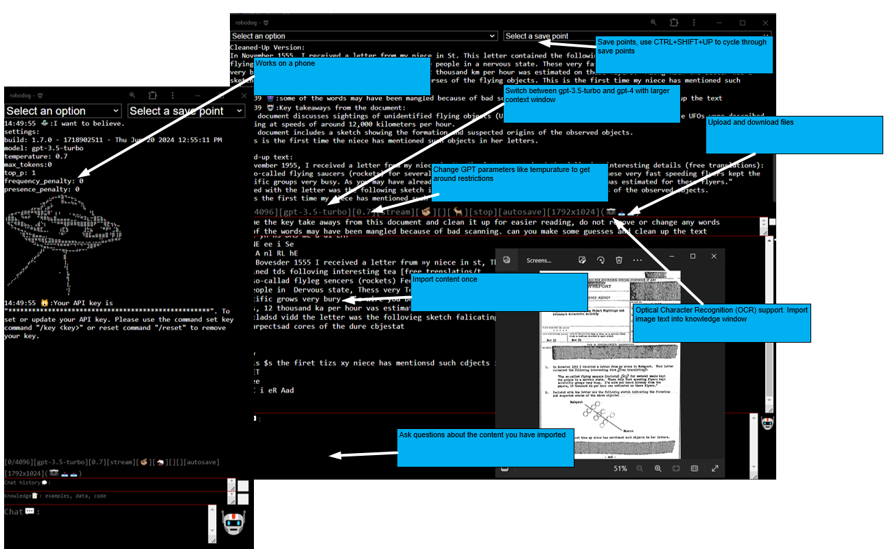

# Robodog AI

# About

Robodog AI is a UI to call openai GPT models and is built using React, TypeScript, and Webpack. 

# Features

* Flexible runtime, install on a laptop, in github pages, your own static file server. 
* No need to install npm or run a node server
  * The webpack build creates two files
  * It compiles into a single HTML file named `robodog.html` and a single JavaScript bundle `robotdog.bundle.js`.
  * You do not need to install npm to run the tool.
  * A prompt will ask you for your API key. it is stored in local storage.
* All chat history is added to the ‘chat context’ text box. 
  * If you have ever had an argument with the GPT AI, you know why this is here. You can add and remove chat context at any time.
* Add your knowledge. Any code or documents you need to ask the AI about can go here.
* Add your question.
* Switch between GPT3.5 and GPT4 models without losing chat context. 
  * Validate your questions and answers on a different model. 
  * In the future, you may be able to validate using a different LLM provider.
  * Switch between cheap and expensive models.

# Indicators

* [3432/9000] - estimated remaining context
* [rest] - rest completion mode
* [stream] - stream completion mode
* [486+929=1415] - token usage
* [🦥] - ready
* [🦧] - thinking
* [gpt-3.5-turbo-1106] - GPT model
* [🐘] - Context + knowledge + chat is dangerously large.

# Screenshots

# Build

* cd robodog
* npm install
* npm install openai
* npm install zip-webpack-plugin
* npm run build

# Run

* Open in a `.\dist\robodog.html` in a browser.

# Commands

* /gpt-3.5-turbo - switch to gpt-3.5-turbo-1106 model (4,096 tokens).
* /gpt-3.5-turbo-16k - switch to gpt-3.5-turbo-16k model (16,385 tokens).
* /gpt-3.5-turbo-1106 - switch to gpt-3.5-turbo-1106 model (16,385 tokens).
* /gpt-4 - switch to gpt-4 model (8,192 tokens).
* /gpt-4-1106-preview - switch to gpt-4-1106-preview model (128,000 tokens).
* /help - get help.
* /clear - get help.
* /rest - use rest completions
* /stream - use stream completions
* /reset - Reset your API key

# Try

* [Robodog](https://adourish.github.io/robodog/robodog/dist/)

# Download

* [Download Robodog](https://github.com/adourish/robodog/tree/main/robodog/dist/robodog.zip)
