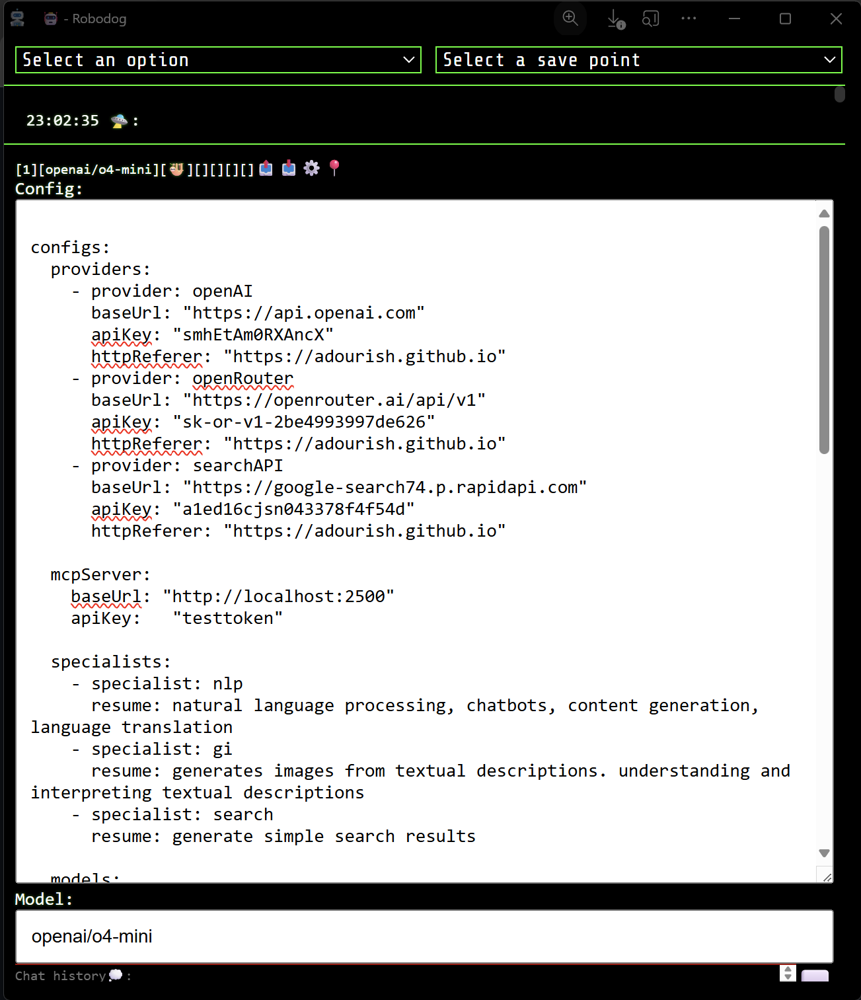
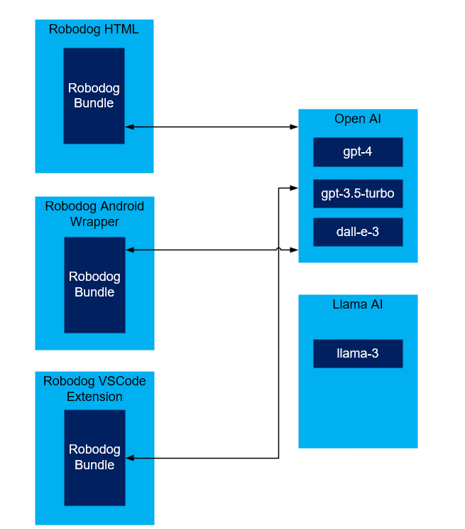
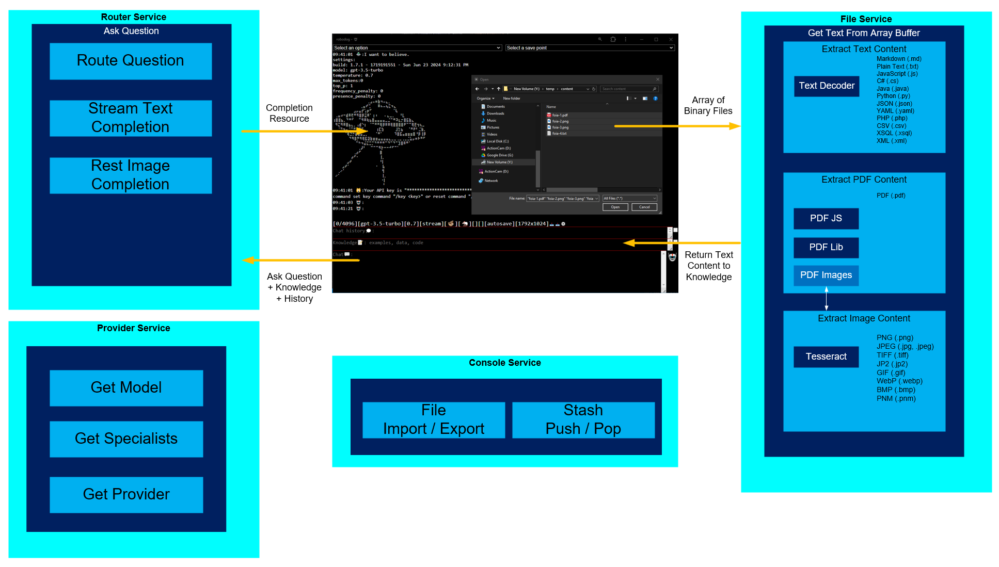
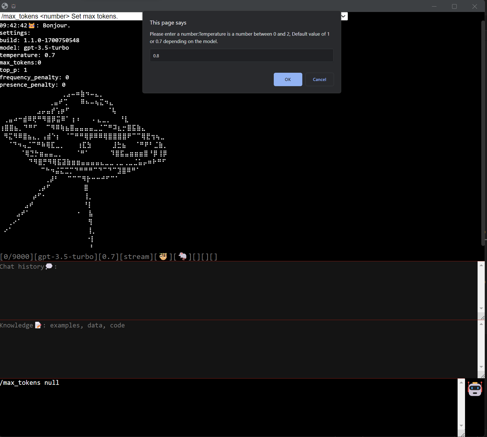

# Robodog AI

## About

Robodog is a GPT client with support for gpt-3.5-turbo, gpt-4, gpt-4-turbo, dall-e-3, and gpt-3.5-turbo-16k. It provides a highly portal GPT UI with support for uploading files, saving points, and temperature configurations.

## Try Robodog

- [Robodog web](https://adourish.github.io/robodog/robodog/dist/)
- [Robodog Android](https://play.google.com/store/apps/details?id=com.unclebulgaria.robodog)
- npm packages:
  - [robodoglib](https://www.npmjs.com/package/robodoglib)
  - [robodogcli](https://www.npmjs.com/package/robodogcli)
  - [robodog](https://www.npmjs.com/package/robodog)

## Configuring Providers and Models

- Click ⚙️ to configure



## History

### Version 1.0.0
- Support for /models <model>. Most text-based models are supported
- Support for /gpt-3.5-turbo and /gpt-4 quick
- Support for rest completions

### Version 1.1.0
- Support for stream completions

### Version 1.2.0
- Support for /stash /pop /list save points
- Support for /clear and /reset
- Support for /temperature and /frequency_penalty

### Version 1.3.0
- Support for /import (.md, .txt, .js, .cs, .java, .py, json, .yaml, .php, .csv, .json)
- Support for drop-down commands selection
- Auto save point

### Version 1.4.0
- Section 508 support
- Mobile support (some issues)
- Support for CTRL+SHIFT+UP cycle through save points
- Support for CTRL+S to save content to a file

### Version 1.5.0
- Support for /model dall-e-3

### Version 1.6.0
- Medium refactor to support other AI providers. (Note: No support for Google products)
- Minor UX changes

### Version 1.7.0
- Added image to text processing
  - Optical Character Recognition (OCR) support using the Tesseract library
- Added PDF to text processing
  - PDF processing using PDF Lib and PDF JS
- Android closed testing

### Version 1.7.1
- Bug fixes and UX improvements

### Version 1.7.2
- CLI and RobodogLib npm package

### Version 2.0.0
- Support for multiple providers: llamaAI and openAI
- YAML configuration

## Roadmap 
- OCR support for Android
- VSCode extension

## Features

Robodog AI Assistant provides a flexible runtime, allowing installation on a laptop, GitHub pages, or a personal static file server without the need to install npm or run a node server. The webpack build generates two files, compiling them into a single HTML file named `robodog.html` and a JavaScript bundle called `robotdog.bundle.js`. Additionally, the tool does not require npm installation as it simply prompts for the API key, which is stored in local storage.

All chat history is conveniently accumulated in the 'chat context' text box, ensuring seamless continuation of conversations with the GPT AI. The feature allows users to add or remove chat contexts as needed. Users can also incorporate their knowledge, code, or documents for AI assistance and pose questions for optimized interactions.

Furthermore, users can effortlessly switch between GPT3.5 and GPT4 models without losing their chat context, enabling them to validate their questions and answers on a different model. Additionally, the system allows flexibility in choosing between cost-effective and higher-priced models, ensuring diverse options for tailored AI interactions.


## Architecture






## Create an API Key

Create an Open AI account and generate a new secret key [here](https://platform.openai.com/api-keys).

## Responsive

The UI is responsive and will work on a phone. You can use the GitHub pages link [Robodog](https://adourish.github.io/robodog/robodog/dist/)


## Dall-e-

Dall-e-3 is supported


## Accessibility

The UX was developed with section [508](https://www.section508.gov/) and [web accessibility](https://www.w3.org/WAI/fundamentals/accessibility-intro/) in mind. All of the actions (e.g., /clear, /gpt-4, /rest, /help) can be executed from the chat window without navigating a menu. The UI has been validated using the [Wave tool](https://wave.webaim.org/), but has not been tested with a screen reader like [Jaws](https://www.freedomscientific.com/products/software/jaws/). However, it should work for the /rest mode; the /stream mode may not be fully accessible. If there is a need for an accessible GPT client, I am willing to explore the use of Aria tags and make the /stream mode accessible.

## How it works

The chat/question is linked to the chat history and knowledge text areas:
```javascript
 const _messages = [
    { role: "user", content: "chat history:" + context },
    { role: "user", content: "knowledge:" + knowledge  },
    { role: "user", content: "question:" + text + ". Use the content in knowledge and chat history to answer the question." }
  ];
```

## Import

Use the /import command to open a file picker. You can select one or more files, and they will be imported into the knowledge text area. You can use the /export feature to dump the content of your knowledge into a file.


## Indicators

Use the char, rest, stream, status sloth/ape indicators to streamline your experience. 

- [0/9000][gpt-3.5-turbo][0.7][stream][🦥][🐁][][]

- [3432/9000] - estimated remaining context + knowledge + chat
- [gpt-3.5-turbo] - GPT model
- [0.7] - temperature - larger numbers promote more creativity and are more prone to hallucination
- [rest] - rest completion mode
- [stream] - stream completion mode
- [🦥] - ready
- [🦧] - thinking
- [gpt-3.5-turbo-1106] - GPT model
- [🐋] - 💬📝💭 is dangerously large. Good luck to you.
- [🦕] - 💬📝💭 is very large.
- [🐘] - 💬📝💭 is large.
- [🐁] - 💬📝💭 is acceptable.

## Emoji

Role Emojis:
- 👾 - User
- 🤖 - Assistant
- 💾 - System
- 👹 - Event
- 💩 - Error
- 🍄 - Warning
- 😹 - Info
- 💣 - Experiment
- 🙀 - Default

Status Emojis:
- 🦥 - Ready
- 🦧 - Thinking
- 🐋 - Dangerously large
- 🦕 - Very large
- 🐘 - Large
- 🐁 - Acceptable

Performance Emojis: 
- 🐢 - Tortoise - longer than 20 seconds
- 🦅 - Hourglass - less than 1 second or more than 5 seconds
- 🦘 - Kangaroo
- 🐆 - Leopard
- 🦌 - Deer
- 🐕 - Dog
- 🐅 - Tiger
- 🐈 - Cat

Other Emojis:
- 💭 - Chat History
- 📝 - Knowledge Content
- 💬 - Chat Text


## Stash, pop, and list

Switch chat contexts using the stash, pop, and list commands.

-   /stash <name> - stash 💬📝💭.
-   /pop <name> - pop 💬📝💭.
-   /list - list of stashed 💬📝💭.


## Menu

Use the drop-down menu to select options.



## Optical Character Recognition (OCR) support using the Tesseract library

Optical Character Recognition (OCR) is the process that converts an image of text into a machine-readable text format. For example, if you scan a form or a receipt, your computer saves the scan as an image file. You cannot use a text editor to edit, search, or count the words in the image file.

- image-to-text using Tesseract
- text-to-image using dall-e-3


## Build

-   cd robodog
-   npm install
-   npm install openai
-   npm install zip-webpack-plugin
-   npm install pdfjs-dist
-   npm install axios
-   npm run build

## Run

-   Open `.\dist\robodog.html` in a browser.

## Commands

-   /gpt-3.5-turbo - switch to gpt-3.5-turbo-1106 model (4,096 tokens)(default).
-   /gpt-3.5-turbo-16k - switch to gpt-3.5-turbo-16k model (16,385 tokens).
-   /gpt-3.5-turbo-1106 - switch to gpt-3.5-turbo-1106 model (16,385 tokens).
-   /gpt-4 - switch to gpt-4 model (8,192 tokens).
-   /gpt-4-1106-preview - switch to gpt-4-1106-preview model (128,000 tokens).
-   /search
-   /model <name> - set to a specific model.
-   /model dall-e-3
-   /help - get help.
-   /import - import files into knowledge (.md, .txt, .pdf, .js, .cs, .java, .py, json, .yaml, .php, .csv, .xsql, .json, .xml).
-   /export <filename> - export knowledge to a file.
-   /clear - clear 💬📝💭.
-   /reset - reset all settings
-   /rest - use rest completions.
-   /toggle - toggle context and knowledge text areas
-   /stream - use stream completions (default).
-   /reset - Reset your API key.
-   /stash <name> - stash 💬📝💭.
-   /stash clear
-   /pop <name> - pop 💬📝💭.
-   /list - list of stashed 💬📝💭.
-   /temperature 0.7 - If your use case allows for high variability or personalization (such as product recommendations) from user to user, we recommend a temperature of 0.7 or higher. For more static responses, such as answers to FAQs on return policies or shipping rates, adjust it to 0.4. We’ve also found that with a higher temperature metric, the model tends to add 10 to 15 words on top of your word/token limit, so keep that in mind when setting your parameters.
-   /max_tokens 500 - for short, concise responses (which in our experience is always best), choose a value between 30 and 50, depending on the main use cases of your chatbot.
-   /top_p 1 - recommend keeping this at 1, adjusting your temperature instead for the best results.
-   /frequency_penalty 0 - determine how often the same words appear in the chatbot’s response. Keep at 0.
-   /presence_penalty 0 - determine how often the same words appear in the chatbot’s response. Keep at 0.
-   SHIFT+UP - cycle through stash list.
-   CTRL + S - save a snapshot to storage.

## Try

-   [Robodog](https://adourish.github.io/robodog/robodog/dist/)

## Download

-   [Download Robodog](https://github.com/adourish/robodog/tree/main/robodog/dist/robodog.zip)

## RobodogLib

To use RobodogLib in your project, follow these steps:

0. Install
```
npm install RobodogLib
```

1. Importing the necessary libraries:
```javascript
import { FileService } from 'RobodogLib';
import { SearchService } from 'RobodogLib';
import { ProviderService } from 'RobodogLib';
import { RouterModel } from 'RobodogLib';
import { PerformanceCalculator } from 'RobodogLib';
import { FormatService } from 'RobodogLib';
import { ConsoleService } from 'RobodogLib';
import { YamlConfigService } from 'RobodogLib';
```

2. Extracting text content from various file formats:

```javascript
const fileService = new FileService();

// Example 1: Extracting text from a PDF file
const pdfFile = new File(['<pdf file content>'], 'example.pdf', { type: 'application/pdf' });
fileService.getTextFromArrayBuffer(pdfFile.arrayBuffer, pdfFile.type, pdfFile.name)
  .then((result) => {
    console.log('PDF File Text:', result);
  })
  .catch((error) => {
    console.error('Error extracting text from PDF file:', error);
  });

// Example 2: Extracting text from an image file
const imageFile = new File(['<image file content>'], 'example.jpg', { type: 'image/jpeg' });
fileService.getTextFromArrayBuffer(imageFile.arrayBuffer, imageFile.type, imageFile.name)
  .then((result) => {
    console.log('Image File Text:', result);
  })
  .catch((error) => {
    console.error('Error extracting text from image file:', error);
  });

// Example 3: Extracting text from a plain text file
const textFile = new File(['<text file content>'], 'example.txt', { type: 'text/plain' });
fileService.getTextFromArrayBuffer(textFile.arrayBuffer, textFile.type, textFile.name)
  .then((result) => {
    console.log('Text File Text:', result);
  })
  .catch((error) => {
    console.error('Error extracting text from text file:', error);
  });

// Example 4: Handling unsupported file formats
const unsupportedFile = new File(['<unsupported file content>'], 'example.docx', { type: 'application/vnd.openxmlformats-officedocument.wordprocessingml.document' });
fileService.getTextFromArrayBuffer(unsupportedFile.arrayBuffer, unsupportedFile.type, unsupportedFile.name)
  .then((result) => {
    console.log('Unsupported File Text:', result);
  })
  .catch((error) => {
    console.error('Error extracting text from unsupported file:', error);
  });
```

3. Searching for information using the SearchService:
```javascript
const searchService = new SearchService();
const text = "How to use RobodogLib?";
const setContent = (content) => {
  // Update the content with the search results
};

searchService.search(text, setContent);
```

4. Managing configuration using the ProviderService and YamlConfigService:
```javascript
const providerService = new ProviderService();
const yamlConfigService = new YamlConfigService();
const defaultYaml = yamlConfigService.getDefaults();
const customYaml = `
configs:
  providers:
    - provider: openAI
      baseUrl: "https://api.openai.com"
      apiKey: ""
    - provider: llamaAI
      baseUrl: "https://api.llama-api.com"
      apiKey: ""
    - provider: searchAPI
      baseUrl: "https://google-search74.p.rapidapi.com"
      apiKey: ""
      
  specialists:
    - specialist: nlp
      resume: natural language processing, chatbots, content generation, language translation
    - specialist: gi
      resume: generates images from textual descriptions. understanding and interpreting textual descriptions 
    - specialist: search
      resume: generate simple search results

  models:
    - provider: openAI
      model: gpt-4
      stream: true
      specialist: nlp
`;

providerService.setYaml(customYaml);
const currentYaml = providerService.getYaml();
```

5. Handling performance calculations using the PerformanceCalculator:
```javascript
const performanceCalculator = new PerformanceCalculator();
performanceCalculator.start();
performanceCalculator.end();
const duration = performanceCalculator.calculateDuration();
```

6. Formatting messages using the FormatService:
```javascript
const formatService = new FormatService();
const message = formatService.getMessageWithTimestamp('Hello RobodogLib!', 'user');
const messageWithUrl = formatService.getMessageWithTimestamp('Here is the documentation:', 'assistant', 'https://robodoglib-docs.com');
```

7. Router Service example
```javascript
const routerService = new RobodogLib.RouterService();
const routerModel = new RobodogLib.RouterModel(
  "How tall is devils tower?", // Question (required)
  "gpt-4", // Model (required)
  "Where is devils tower", // History (optional)
  "places to climb: devils tower, custer state park, red river gorge", // Knowledge (optional)
  [], // Content (optional)
  0.8, // Temperature (optional)
  50, // Max tokens (optional)
  "", // Current key (optional)
  "1792x1024", // Size (optional)
  {
    setContent: setContent,
    setMessage: setMessage,
    setPerformance: setPerformance,
    setThinking: setThinking
  }
);
const response = await routerService.routeQuestion(routerModel);
console.debug(response);
```
